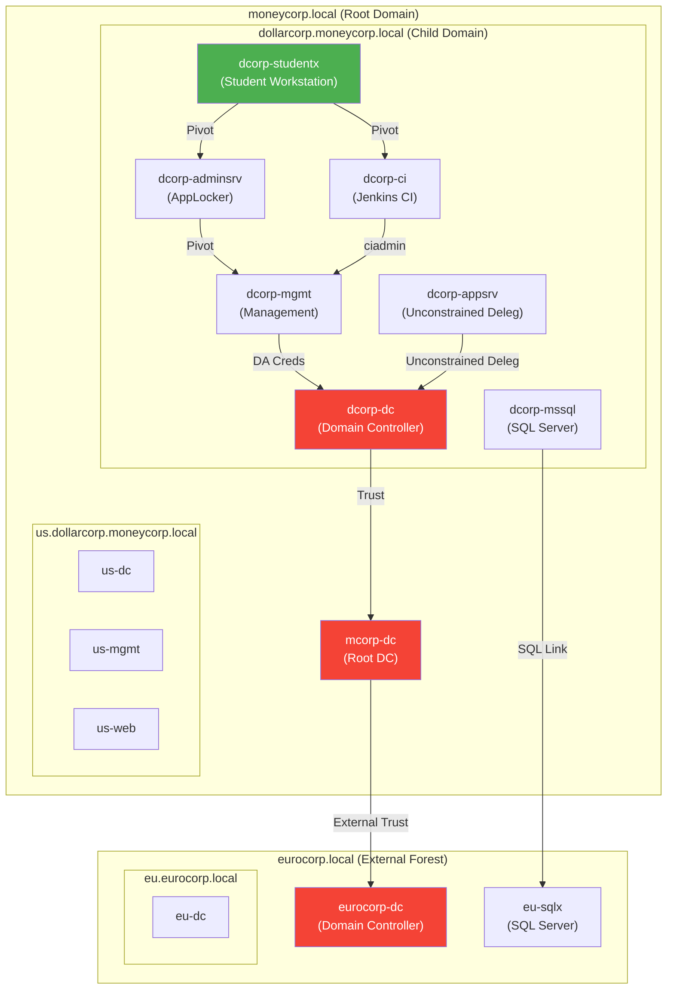

# CRTP Lab Topology

```mermaid
graph TD
    subgraph eurocorp["eurocorp.local (External Forest)"]
        EUROCORP_DC["eurocorp-dc\n(Domain Controller)"]
        EU_SQLX["eu-sqlx\n(SQL Server)"]
        subgraph eu_child["eu.eurocorp.local"]
            EU_DC["eu-dc"]
        end
    end

    subgraph moneycorp["moneycorp.local (Root Domain)"]
        MCORP_DC["mcorp-dc\n(Root DC)"]
        subgraph dollarcorp["dollarcorp.moneycorp.local (Child Domain)"]
            DCORP_DC["dcorp-dc\n(Domain Controller)"]
            DCORP_APPSRV["dcorp-appsrv\n(Unconstrained Deleg)"]
            DCORP_ADMINSRV["dcorp-adminsrv\n(AppLocker)"]
            DCORP_MGMT["dcorp-mgmt\n(Management)"]
            DCORP_MSSQL["dcorp-mssql\n(SQL Server)"]
            DCORP_CI["dcorp-ci\n(Jenkins CI)"]
            DCORP_STUDENT["dcorp-studentx\n(Student Workstation)"]
        end
        subgraph us_domain["us.dollarcorp.moneycorp.local"]
            US_DC["us-dc"]
            US_MGMT["us-mgmt"]
            US_WEB["us-web"]
        end
    end

    DCORP_STUDENT -->|"Pivot"| DCORP_ADMINSRV
    DCORP_STUDENT -->|"Pivot"| DCORP_CI
    DCORP_ADMINSRV -->|"Pivot"| DCORP_MGMT
    DCORP_MGMT -->|"DA Creds"| DCORP_DC
    DCORP_CI -->|"ciadmin"| DCORP_MGMT
    DCORP_APPSRV -->|"Unconstrained Deleg"| DCORP_DC
    DCORP_MSSQL -->|"SQL Link"| EU_SQLX
    DCORP_DC -->|"Trust"| MCORP_DC
    MCORP_DC -->|"External Trust"| EUROCORP_DC

    style DCORP_STUDENT fill:#4CAF50,color:#fff
    style DCORP_DC fill:#f44336,color:#fff
    style MCORP_DC fill:#f44336,color:#fff
    style EUROCORP_DC fill:#f44336,color:#fff
```
