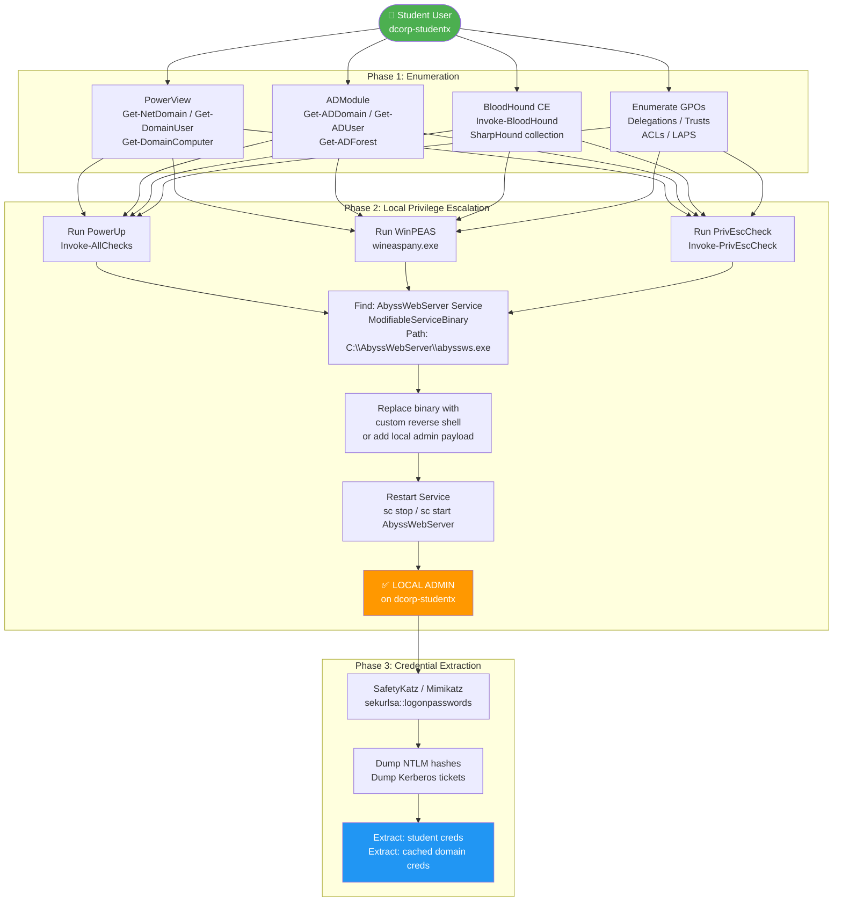
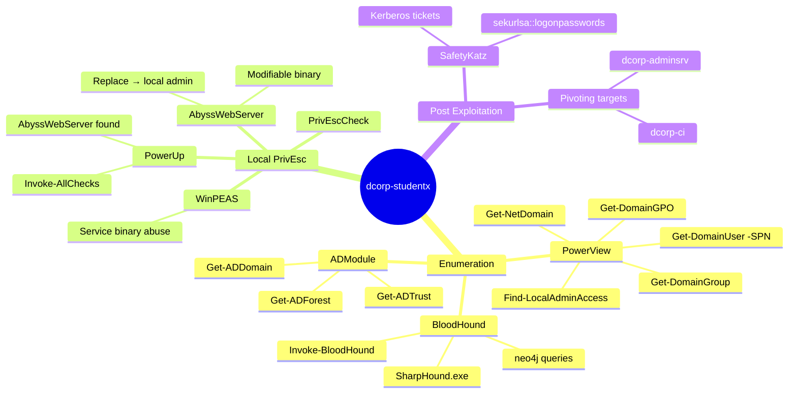

# dcorp-studentx — Initial Compromise & Local Privilege Escalation

## Attack Path

```mermaid
flowchart TD
    START(["👤 Student User\ndcorp-studentx"])

    subgraph enum["Phase 1: Enumeration"]
        E1["PowerView\nGet-NetDomain / Get-DomainUser\nGet-DomainComputer"]
        E2["ADModule\nGet-ADDomain / Get-ADUser\nGet-ADForest"]
        E3["BloodHound CE\nInvoke-BloodHound\nSharpHound collection"]
        E4["Enumerate GPOs\nDelegations / Trusts\nACLs / LAPS"]
    end

    subgraph privesc["Phase 2: Local Privilege Escalation"]
        P1["Run PowerUp\nInvoke-AllChecks"]
        P2["Run WinPEAS\nwineaspany.exe"]
        P3["Run PrivEscCheck\nInvoke-PrivEscCheck"]
        P4["Find: AbyssWebServer Service\nModifiableServiceBinary\nPath: C:\\AbyssWebServer\\abyssws.exe"]
        P5["Replace binary with\ncustom reverse shell\nor add local admin payload"]
        P6["Restart Service\nsc stop / sc start AbyssWebServer"]
        P7["✅ LOCAL ADMIN\non dcorp-studentx"]
    end

    subgraph creds["Phase 3: Credential Extraction"]
        C1["SafetyKatz / Mimikatz\nsekurlsa::logonpasswords"]
        C2["Dump NTLM hashes\nDump Kerberos tickets"]
        C3["Extract: student creds\nExtract: cached domain creds"]
    end

    START --> E1 & E2 & E3 & E4
    E1 & E2 & E3 & E4 --> P1 & P2 & P3
    P1 & P2 & P3 --> P4
    P4 --> P5 --> P6 --> P7
    P7 --> C1 --> C2 --> C3

    style START fill:#4CAF50,color:#fff
    style P7 fill:#FF9800,color:#fff
    style C3 fill:#2196F3,color:#fff
```

## Mindmap

```mermaid
mindmap
  root((dcorp-studentx))
    Enumeration
      PowerView
        Get-NetDomain
        Get-DomainUser -SPN
        Get-DomainGroup
        Get-DomainGPO
        Find-LocalAdminAccess
      ADModule
        Get-ADDomain
        Get-ADForest
        Get-ADTrust
      BloodHound
        Invoke-BloodHound
        SharpHound.exe
        neo4j queries
    Local PrivEsc
      PowerUp
        Invoke-AllChecks
        AbyssWebServer found
      WinPEAS
        Service binary abuse
      PrivEscCheck
      AbyssWebServer
        Modifiable binary
        Replace → local admin
    Post Exploitation
      SafetyKatz
        sekurlsa::logonpasswords
        Kerberos tickets
      Pivoting targets
        dcorp-adminsrv
        dcorp-ci
```
