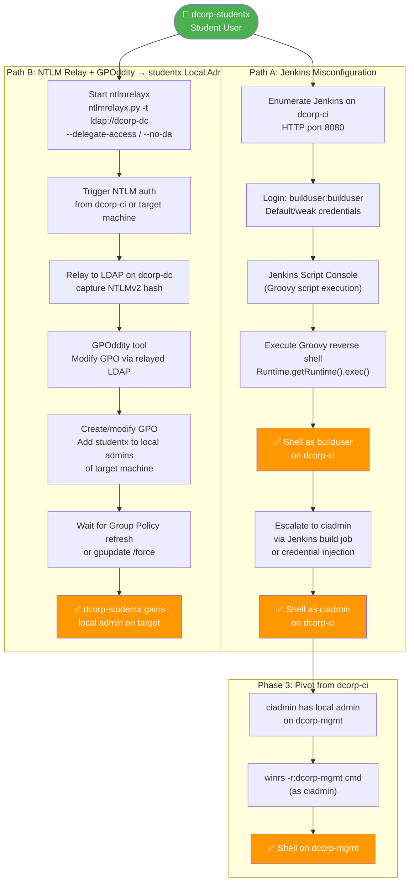
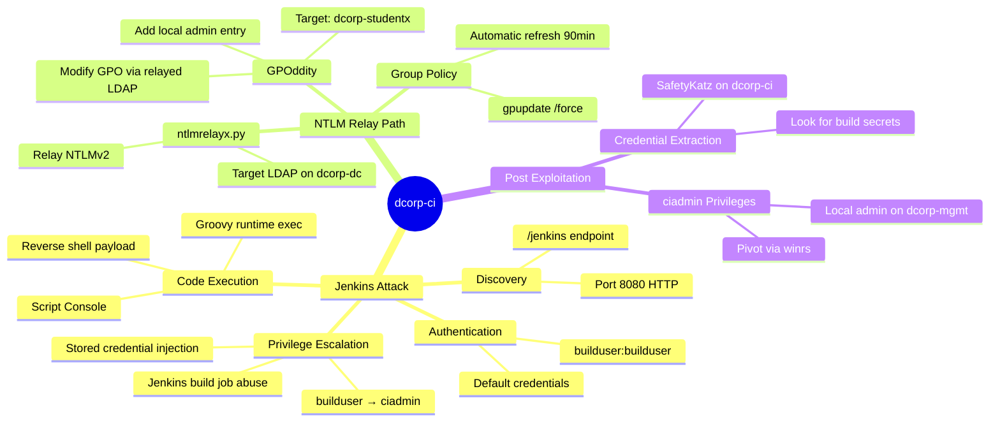

# dcorp-ci — Jenkins Misconfiguration & NTLM Relay via GPOddity

## Attack Path

```mermaid
flowchart TD
    START(["🔑 dcorp-studentx\nStudent User"])

    subgraph jenkins["Path A: Jenkins Misconfiguration"]
        J1["Enumerate Jenkins on dcorp-ci\nHTTP port 8080"]
        J2["Login: builduser:builduser\nDefault/weak credentials"]
        J3["Jenkins Script Console\n(Groovy script execution)"]
        J4["Execute Groovy reverse shell\nRuntime.getRuntime().exec()"]
        J5["✅ Shell as builduser\non dcorp-ci"]
        J6["Escalate to ciadmin\nvia Jenkins build job\nor credential injection"]
        J7["✅ Shell as ciadmin\non dcorp-ci"]
    end

    subgraph ntlm["Path B: NTLM Relay + GPOddity → studentx Local Admin"]
        N1["Start ntlmrelayx\nntlmrelayx.py -t ldap://dcorp-dc\n--delegate-access / --no-da"]
        N2["Trigger NTLM auth\nfrom dcorp-ci or target machine"]
        N3["Relay to LDAP on dcorp-dc\ncapture NTLMv2 hash"]
        N4["GPOddity tool\nModify GPO via relayed LDAP"]
        N5["Create/modify GPO\nAdd studentx to local admins\nof target machine"]
        N6["Wait for Group Policy refresh\nor gpupdate /force"]
        N7["✅ dcorp-studentx gains\nlocal admin on target"]
    end

    subgraph pivot["Phase 3: Pivot from dcorp-ci"]
        P1["ciadmin has local admin\non dcorp-mgmt"]
        P2["winrs -r:dcorp-mgmt cmd\n(as ciadmin)"]
        P3["✅ Shell on dcorp-mgmt"]
    end

    START --> J1 --> J2 --> J3 --> J4 --> J5 --> J6 --> J7
    START --> N1 --> N2 --> N3 --> N4 --> N5 --> N6 --> N7
    J7 --> P1 --> P2 --> P3

    style START fill:#4CAF50,color:#fff
    style J5 fill:#FF9800,color:#fff
    style J7 fill:#FF9800,color:#fff
    style N7 fill:#FF9800,color:#fff
    style P3 fill:#FF9800,color:#fff
```

## Mindmap

```mermaid
mindmap
  root((dcorp-ci))
    Jenkins Attack
      Discovery
        Port 8080 HTTP
        /jenkins endpoint
      Authentication
        builduser:builduser
        Default credentials
      Code Execution
        Script Console
        Groovy runtime exec
        Reverse shell payload
      Privilege Escalation
        builduser → ciadmin
        Jenkins build job abuse
        Stored credential injection
    NTLM Relay Path
      ntlmrelayx.py
        Target LDAP on dcorp-dc
        Relay NTLMv2
      GPOddity
        Modify GPO via relayed LDAP
        Add local admin entry
        Target: dcorp-studentx
      Group Policy
        gpupdate /force
        Automatic refresh 90min
    Post Exploitation
      ciadmin Privileges
        Local admin on dcorp-mgmt
        Pivot via winrs
      Credential Extraction
        SafetyKatz on dcorp-ci
        Look for build secrets
```
