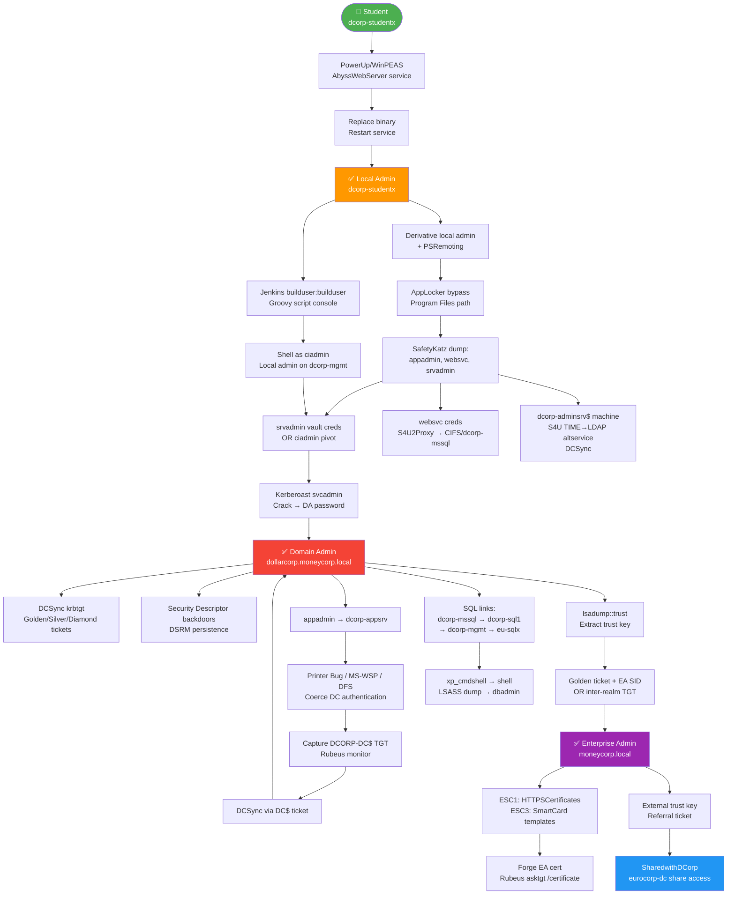
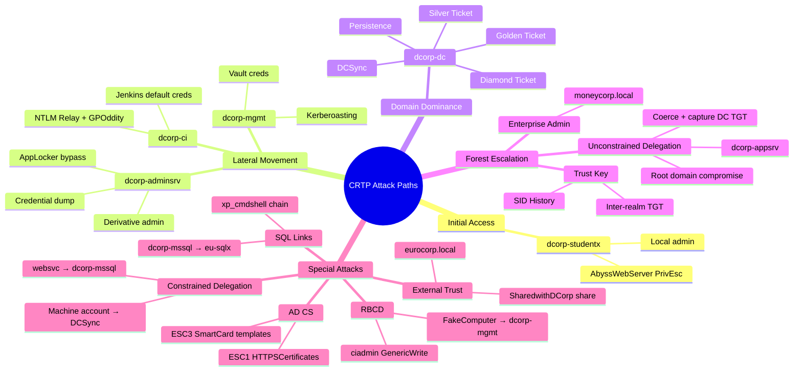

# CRTP Full Attack Chain — End-to-End Compromise

## Complete Attack Flow

```mermaid
flowchart TD
    START(["👤 Student\ndcorp-studentx"])

    %% Phase 1: Local PrivEsc
    LP1["PowerUp/WinPEAS\nAbyssWebServer service"]
    LP2["Replace binary\nRestart service"]
    LP3["✅ Local Admin\ndcorp-studentx"]

    %% Phase 2: Lateral to adminsrv
    LA1["Derivative local admin\n+ PSRemoting"]
    LA2["AppLocker bypass\nProgram Files path"]
    LA3["SafetyKatz dump:\nappadmin, websvc, srvadmin"]

    %% Phase 3: CI Server
    CI1["Jenkins builduser:builduser\nGroovy script console"]
    CI2["Shell as ciadmin\nLocal admin on dcorp-mgmt"]

    %% Phase 4: dcorp-mgmt
    MG1["srvadmin vault creds\nOR ciadmin pivot"]
    MG2["Kerberoast svcadmin\nCrack → DA password"]

    %% Phase 5: Domain Admin
    DA1["✅ Domain Admin\ndollarcorp.moneycorp.local"]
    DA2["DCSync krbtgt\nGolden/Silver/Diamond tickets"]
    DA3["Security Descriptor backdoors\nDSRM persistence"]

    %% Phase 6: Unconstrained Deleg
    UD1["appadmin → dcorp-appsrv"]
    UD2["Printer Bug / MS-WSP / DFS\nCoerce DC authentication"]
    UD3["Capture DCORP-DC$ TGT\nRubeus monitor"]
    UD4["DCSync via DC$ ticket"]

    %% Phase 7: Trust Escalation
    TE1["lsadump::trust\nExtract trust key"]
    TE2["Golden ticket + EA SID\nOR inter-realm TGT"]
    TE3["✅ Enterprise Admin\nmoneycorp.local"]

    %% Phase 8: Constrained Deleg
    CD1["websvc creds\nS4U2Proxy → CIFS/dcorp-mssql"]
    CD2["dcorp-adminsrv$ machine\nS4U TIME→LDAP altservice\nDCSync"]

    %% Phase 9: SQL Chain
    SQL1["SQL links:\ndcorp-mssql → dcorp-sql1\n→ dcorp-mgmt → eu-sqlx"]
    SQL2["xp_cmdshell → shell\nLSASS dump → dbadmin"]

    %% Phase 10: AD CS
    CS1["ESC1: HTTPSCertificates\nESC3: SmartCard templates"]
    CS2["Forge EA cert\nRubeus asktgt /certificate"]

    %% Phase 11: External Trust
    EX1["External trust key\nReferral ticket"]
    EX2["SharedwithDCorp\neurocorp-dc share access"]

    START --> LP1 --> LP2 --> LP3
    LP3 --> LA1 --> LA2 --> LA3
    LP3 --> CI1 --> CI2
    LA3 --> MG1
    CI2 --> MG1
    MG1 --> MG2 --> DA1
    DA1 --> DA2 & DA3
    DA1 --> UD1 --> UD2 --> UD3 --> UD4
    UD4 --> DA1
    DA1 --> TE1 --> TE2 --> TE3
    LA3 --> CD1 & CD2
    DA1 --> SQL1 --> SQL2
    TE3 --> CS1 --> CS2
    TE3 --> EX1 --> EX2

    style START fill:#4CAF50,color:#fff
    style LP3 fill:#FF9800,color:#fff
    style DA1 fill:#f44336,color:#fff
    style TE3 fill:#9C27B0,color:#fff
    style EX2 fill:#2196F3,color:#fff
```

## Attack Surface Summary

```mermaid
mindmap
  root((CRTP Attack Paths))
    Initial Access
      dcorp-studentx
        AbyssWebServer PrivEsc
        Local admin
    Lateral Movement
      dcorp-adminsrv
        Derivative admin
        AppLocker bypass
        Credential dump
      dcorp-ci
        Jenkins default creds
        NTLM Relay + GPOddity
      dcorp-mgmt
        Vault creds
        Kerberoasting
    Domain Dominance
      dcorp-dc
        DCSync
        Golden Ticket
        Silver Ticket
        Diamond Ticket
        Persistence
    Forest Escalation
      Unconstrained Delegation
        dcorp-appsrv
        Coerce + capture DC TGT
        Root domain compromise
      Trust Key
        SID History
        Inter-realm TGT
      Enterprise Admin
        moneycorp.local
    Special Attacks
      Constrained Delegation
        websvc → dcorp-mssql
        Machine account → DCSync
      RBCD
        ciadmin GenericWrite
        FakeComputer → dcorp-mgmt
      AD CS
        ESC1 HTTPSCertificates
        ESC3 SmartCard templates
      SQL Links
        dcorp-mssql → eu-sqlx
        xp_cmdshell chain
      External Trust
        eurocorp.local
        SharedwithDCorp share
```
